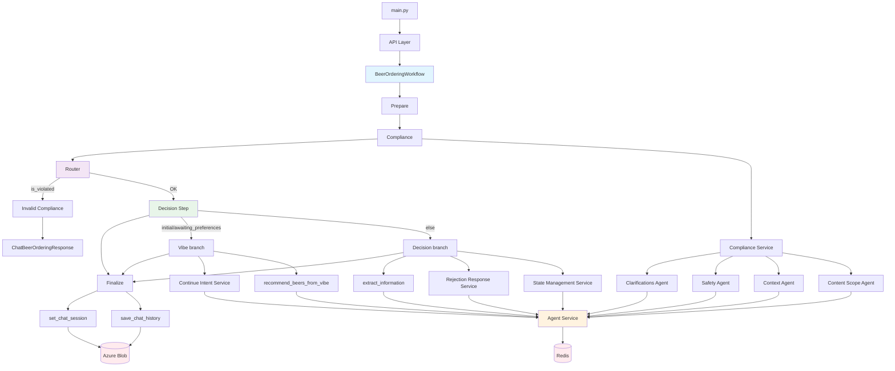
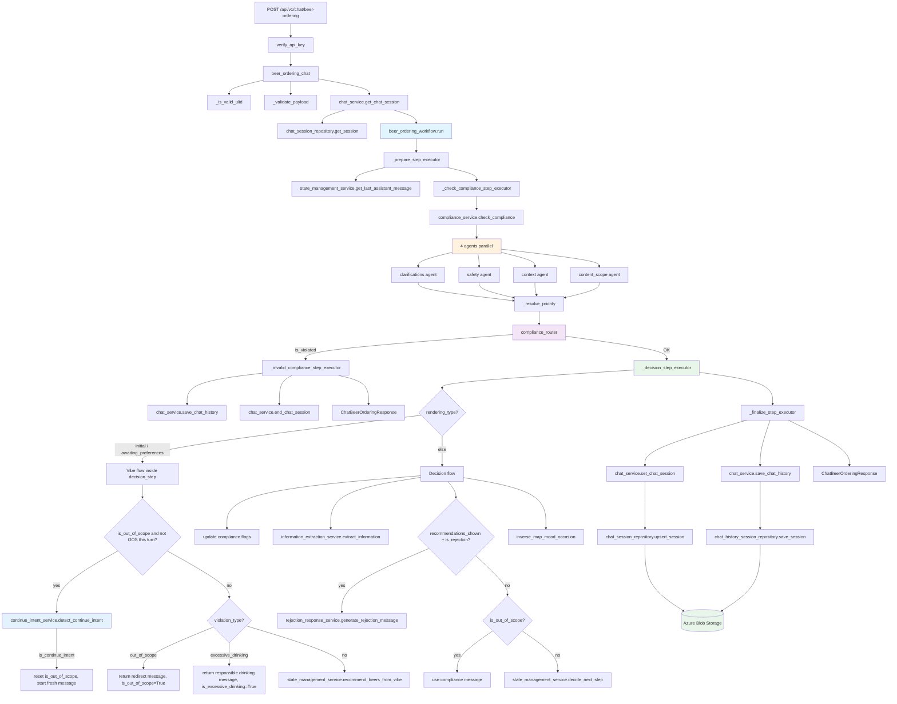

2026-02-18 (Updated: Router luôn chạy decision_step + finalize_step khi compliance OK; Vibe flow & Decision flow nằm trong decision_step; excessive_drinking return sớm trong vibe flow; fallback message chỉ EN, lỗi dùng en-US vs NL)

  
  

Tags: [[TigerTribe]], [[HNK-SMARTAP-BREWBUDDY]]

  

# Overview Architecture

  



  

## Detailed Workflow with Classes/Methods Mapping

  



  

---

  

## Vị trí trong repo

  

```python

beer_ordering_chat() → app/api/chat.py

_is_valid_ulid(), _validate_payload() → app/api/chat.py

  

get_chat_session() → app/services/chat_services/chat_service.py

beer_ordering_workflow.run() → app/services/workflows/beer_ordering_workflow.py

  

_prepare_step_executor() → app/services/workflows/beer_ordering_workflow.py:127

_check_compliance_step_executor() → app/services/workflows/beer_ordering_workflow.py:169

_decision_step_executor() → app/services/workflows/beer_ordering_workflow.py:203

_finalize_step_executor() → app/services/workflows/beer_ordering_workflow.py:637

compliance_router() → app/services/workflows/beer_ordering_workflow.py:725

_invalid_compliance_step_executor() → app/services/workflows/beer_ordering_workflow.py:737

  

check_compliance() → app/services/chat_services/compliance_service.py

extract_information() → app/services/chat_services/information_extraction.py

decide_next_step() → app/services/chat_services/state_management.py

recommend_beers_from_vibe() → app/services/chat_services/state_management.py

detect_continue_intent() → app/services/chat_services/continue_intent_service.py

generate_rejection_message() → app/services/chat_services/rejection_response_service.py

  

set_chat_session(), save_chat_history() → app/services/chat_services/chat_service.py

```

  

## System prompts / agents

  

```python

# Compliance (4 agents)

CLARIFICATIONS_AGENT_SYSTEM_PROMPT, build_clarifications_user_prompt → app/systemprompt/compliance_agent_prompts.py, compliance_agent_user_prompts.py

SAFETY_AGENT_SYSTEM_PROMPT, build_safety_user_prompt → idem

CONTEXT_AGENT_SYSTEM_PROMPT, build_context_user_prompt → idem

CONTENT_SCOPE_AGENT_SYSTEM_PROMPT, build_content_scope_user_prompt → idem (out_of_scope, excessive_drinking)

  

# Vibe & state

BEER_RECOMMENDATION_PROMPT → app/systemprompt/beer_recommendation_system.py (raw user message → infer vibe + recommend 3 beers)

STATE_MANAGEMENT_PROMPT → app/systemprompt/state_management_system.py

INFORMATION_EXTRACTION → app/systemprompt/information_extraction_system.py

  

# Continue intent & rejection

CONTINUE_INTENT_SYSTEM_PROMPT → app/systemprompt/continue_intent_system.py

REJECTION_RESPONSE → app/systemprompt/rejection_response_system.py

```

  

---

  

## Workflow

  

### 1. Trigger

  

- API `beer_ordering_chat` validate và lấy session state.

- `BeerOrderingWorkflow.run()` gọi `self.workflow.arun()`.

- Nếu workflow ném exception → fallback `beer_ordering_service.process_beer_ordering()`.

  

### 2. Execution chain

  

- **Prepare** (`_prepare_step_executor`): Merge request + stored_state → `current_state`, lấy `previous_ai_message` từ history.

- **Compliance** (`_check_compliance_step_executor`): `compliance_service.check_compliance()` → 4 agent song song (clarifications, safety, context, content_scope) → `_resolve_priority()` → `compliance_check`.

- **Router** (`compliance_router`):

- Nếu `compliance_check.is_violated` → chạy **invalid_compliance_step** (save history, end session, trả response với `renderingType="chat-terminated"`).

- Nếu không violated → luôn chạy **[decision_step, finalize_step]** (không có bước “vibe” riêng; vibe vs decision được xử lý bên trong decision_step).

  

### 3. Invalid compliance path

  

- `_invalid_compliance_step_executor`: save_chat_history, end_chat_session, trả `ChatBeerOrderingResponse` với `renderingType="chat-terminated"` và `message` từ compliance.

  

### 4. Happy path – Decision step (gồm cả Vibe flow & Decision flow)

  

**Decision step** (`_decision_step_executor`) vừa cập nhật compliance flags vừa phân nhánh theo `current_state.rendering_type`:

  

- **4a. Vibe flow** (khi `rendering_type` = `initial` hoặc `awaiting_preferences`):

  

1. **Continue sau out_of_scope**: Nếu `is_out_of_scope` và lần này compliance không báo `out_of_scope` → gọi `continue_intent_service.detect_continue_intent()`. Nếu user muốn tiếp tục → reset `is_out_of_scope=False`, trả message "Great! Let's start fresh...", return (không recommend).

2. **Out-of-scope**: Nếu `compliance_check.violation_type == "out_of_scope"` → trả message redirect (từ compliance hoặc fallback tiếng Anh), set `is_out_of_scope=True`, return.

3. **Excessive drinking**: Nếu `compliance_check.violation_type == "excessive_drinking"` → trả message responsible drinking (từ compliance hoặc fallback tiếng Anh), set `is_excessive_drinking=True`, return (không gọi recommend).

4. **Recommend từ raw message**: Gọi `state_management_service.recommend_beers_from_vibe(user_message=...)`. Một LLM call: AI infer vibe từ raw message → chọn 3 bia từ catalog. Có restriction 0% ABV khi driving/pregnancy. Set `rendering_type="recommendations_shown"`, return.

  

- **4b. Decision flow** (khi `rendering_type` khác initial/awaiting_preferences):

  

1. Cập nhật compliance flags từ `compliance_check` (pregnancy, driving, out_of_scope, excessive_drinking, mild_negative_emotion, early_drinking, clarifications).

2. Gọi `extract_information()` (mood, occasion, flavor, intensity, abv, is_rejection, …).

3. **Rejection**: Nếu `rendering_type == "recommendations_shown"` và `is_rejection` → tăng `rejection_count`, gọi `rejection_response_service.generate_rejection_message()`, reset về `awaiting_preferences` (trừ khi đã max rejections).

4. **Out-of-scope trong decision**: Nếu `is_out_of_scope` và `violation_type == "out_of_scope"` → dùng `compliance_check.message`, không gọi `decide_next_step`.

5. Inverse mapping (mood/occasion từ flavor nếu cần), code-level override (đủ selections → order-ensure-confirmation), ép abv-0 khi is_pregnant / is_driving / is_excessive_drinking.

6. Gọi `state_management_service.decide_next_step()` → `StateDecision` (message, renderingType).

  

### 5. Finalize step

  

- `_finalize_step_executor`: Lưu state (`set_chat_session`) và history (`save_chat_history`) lên Azure Blob, trả `ChatBeerOrderingResponse`. Fallback message khi decision.message rỗng: tiếng Anh. Khi exception: `request.lang == "en-US"` → tiếng Anh, còn lại → tiếng Hà Lan.

  

---

  

## Compliance service

  

- **check_compliance()**: Chạy 4 agent song song (asyncio.gather), gộp kết quả bằng `_resolve_priority()`.

- **Clarifications**: pregnancy_clarified, driving_clarified (reset flags).

- **Safety**: underage, mental_health, allergy, profanity, ordering_for_others → `is_violated=True` (terminate).

- **Context**: pregnancy, driving → `is_violated=false`, restrict 0% ABV.

- **Content Scope**: out_of_scope, excessive_drinking → `is_violated=false`; out_of_scope → redirect message, excessive_drinking → responsible drinking message.

- `_resolve_priority()`: CLARIFICATION > HARD_STOP > SOFT_RESTRICTION > INFO_ONLY; trả `ComplianceCheckResponse(is_violated, violation_type, message, reasoning)`.

  

---

  

## Các service chính

  

- **extract_information**: Extract mood, occasion, flavor, intensity, abv, is_rejection, … từ user message; validate với component_type; hỗ trợ chọn từ recommendation list (first/second option, tên bia).

- **recommend_beers_from_vibe**: Một LLM call từ raw user message → opening_message + 3 beers (beer_id, beer_name, intensity, abv, personality_link, bartender_note); restriction 0% khi driving/pregnancy.

- **continue_intent_service.detect_continue_intent**: Phát hiện user muốn tiếp tục sau out-of-scope ("yes", "continue", …). Chỉ gọi khi `is_out_of_scope` và compliance lần này không báo out_of_scope.

- **rejection_response_service.generate_rejection_message**: Message thân thiện khi user reject 3 options; gọi trong decision flow khi `recommendations_shown` và `is_rejection`, trừ khi đã max rejection_count.

- **state_management_service.decide_next_step**: Nhận extracted_info + current state → AI quyết định message và renderingType (mood/occasion/flavor/intensity/abv/order-ensure/order-confirmation/chat-only). Có xử lý is_out_of_scope, is_excessive_drinking, is_mild_negative_emotion, is_early_drinking, recommendation list selection, surpriseMe.

  

---

  

## Conversation stage & routing

  

- **rendering_type** (trong state và response): `initial`, `awaiting_preferences`, `recommendations_shown`, `chat-only`, `mood-selection`, `occasion-selection`, `flavor-selection`, `intensity-selection`, `abv-selection`, `order-ensure-confirmation`, `order-confirmation`, `chat-terminated`.

- **Routing**: Router chỉ dùng `is_violated`. Khi OK luôn chạy decision_step. Bên trong decision_step:

- `initial` hoặc `awaiting_preferences` → Vibe flow (continue intent, out_of_scope, excessive_drinking, recommend_beers_from_vibe).

- Còn lại → Decision flow (extract, rejection, out_of_scope, decide_next_step).

  

---

  

## RenderingType (UI)

  

- `chat-only`: Câu trả lời thông tin, recommendations, hoặc redirect.

- `order-confirmation`: Đủ field và user đã confirm.

- `order-ensure-confirmation`: Đủ field, chưa confirm (kể cả khi chọn từ recommendation list).

- `intensity-selection` / `abv-selection` / `flavor-selection` / `mood-selection` / `occasion-selection`: Thiếu field tương ứng.

- `chat-terminated`: Session kết thúc do compliance violation.

  

---

  

## Flow tóm tắt

  

**Vibe-based (khi initial/awaiting_preferences):**

  

```

User mô tả vibe → (out_of_scope / excessive_drinking → redirect; else) → recommend 3 beers (1 LLM) → User chọn → Confirm

```

  

**Decision (sau khi đã recommendations_shown hoặc các stage khác):**

  

```

Extract info → Rejection? → reset awaiting_preferences; else → Out-of-scope? → compliance message; else → decide_next_step → Finalize

```

  

**Message fallback:** Tất cả fallback trong workflow dùng tiếng Anh. Chỉ khi finalize step gặp exception: `request.lang == "en-US"` thì message tiếng Anh, còn lại tiếng Hà Lan.