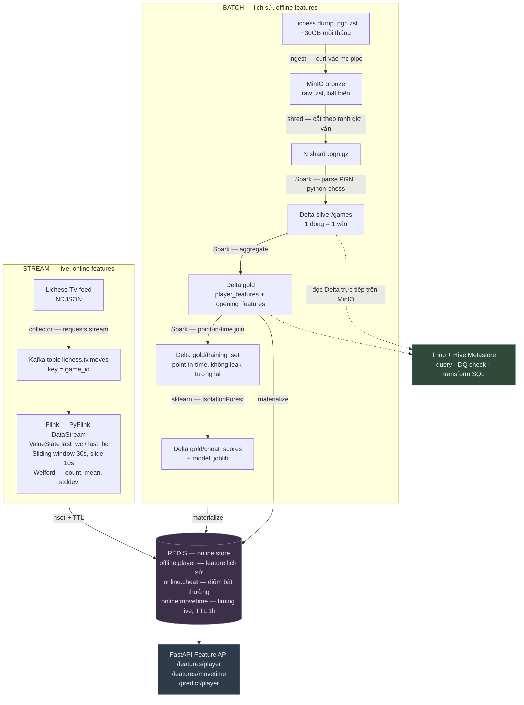

# Hai đường dữ liệu của Lichess Feature Store — bản kể được thành lời

> Mục đích: **nói trôi được** hai flow này, không phải đọc thuộc. Mỗi bước có 3 phần: *chuyện gì xảy ra* — *vì sao cần* — **câu nói ra**.
> Kể theo đúng thứ tự dữ liệu chảy, vì đó là thứ tự người nghe theo dõi dễ nhất.

---

## TOÀN CẢNH — hai đường gặp nhau ở đâu



**Câu chốt về kiến trúc:** hai đường độc lập nhau, **gặp nhau ở Redis**. Đó chính là ý nghĩa của feature store hai tầng: **offline store** (Delta trên MinIO — đầy đủ, chậm, để train) và **online store** (Redis — nhanh, để phục vụ). Cùng một loại feature, hai nơi, hai mục đích.

---

# FLOW 1 — ĐƯỜNG BATCH

> Một câu: *"Đọc dump PGN hàng tháng, parse phân tán bằng Spark thành lakehouse medallion trên MinIO, tính feature cho người chơi và khai cuộc, tạo tập train point-in-time-correct, train model phát hiện bất thường, rồi đẩy feature sang Redis để phục vụ."*

### Bước 0 — Nguồn

**Là gì:** file `lichess_db_standard_rated_<MONTH>.pgn.zst` tải trực tiếp qua HTTP từ Lichess. Một tháng gần đây ~30GB nén, **>150GB khi bung**, khoảng 30 triệu ván. PGN là định dạng text mô tả ván cờ (ai đánh với ai, Elo, kết quả, từng nước đi), nén bằng zstd.

**Nói:** *"Nguồn batch là dump PGN hàng tháng của Lichess, khoảng 30GB nén, bung ra hơn 150GB — tải thẳng qua HTTP, không crawl, không rate limit."*

### Bước 1 — Ingest: đưa vào Bronze

**Chuyện gì:** `curl | mc pipe` — curl tải từ URL, `mc pipe` đẩy thẳng dòng dữ liệu vào MinIO. Dấu pipe nghĩa là dữ liệu chảy **URL → MinIO, không rớt xuống ổ cứng**. Job chạy trong cluster nên dùng băng thông GCP, không đụng máy cá nhân.

**Vì sao Bronze giữ nguyên file gốc, không parse:** nếu sau này logic parse sai, vẫn còn bản gốc để chạy lại — **khỏi tải lại 30GB từ nguồn**. Đây là nguyên tắc chung của tầng Bronze.

**Chi tiết ăn điểm:** job **idempotent** — `mc stat` kiểm tra trước, đã có thì bỏ qua. Object key phân vùng theo tháng: `bronze/.../year_month=<MONTH>/`.

**Nói:** *"Bronze giữ file thô nguyên trạng, không parse gì cả — để nếu logic parse sai thì replay lại được mà không phải tải lại từ nguồn. Job ingest idempotent, chạy lại không tải trùng."*

### Bước 2 — Shred: cắt file để chạy song song ⭐

> Đây là bước **giá trị nhất để kể**, vì có chẩn đoán, có giải pháp, có con số.

**Vấn đề:** file `.zst` **không splittable** — Spark không thể chia một file nén zstd cho nhiều máy cùng đọc. Một file = **một task** = một máy đọc tuần tự = **~62-75 tiếng** cho một tháng. Không dùng được.

**Chẩn đoán:** đây là bài toán **concurrency**, không phải bài toán máy yếu. Thêm máy vô ích khi chỉ có một đơn vị công việc.

**Giải pháp:** đọc file **một lần**, **chỉ giải nén** (không phân tích nội dung — nên rất nhanh), cắt theo **ranh giới ván** (trong PGN mỗi ván mới bắt đầu bằng dòng `[Event ...]`), gom khoảng 30.000 ván thành một shard `.pgn.gz`.

**Kết quả:** N shard → N task chạy song song → **~75 phút xuống ~4 phút**. Code parse không phải sửa gì — chỉ đổi nguồn từ 1 file thành N shard.

**Ẩn dụ dùng được khi giải thích cho người không chuyên (product/DA trong nhóm):** thay vì một người đọc cả cuốn sách 1000 trang, xé thành 30 tập rồi giao 30 người đọc cùng lúc.

**Nói:** *"File zstd không splittable nên Spark chỉ chạy được một task, mất 60-75 tiếng cho một tháng. Em thêm bước shred: đọc một lần, chỉ giải nén chứ không parse, cắt theo ranh giới ván thành nhiều shard nhỏ. Từ đó chạy song song được, xuống còn khoảng 4 phút. Hạ tầng không đổi — chỉ là làm cho dữ liệu chia được."*

### Bước 3 — Bronze → Silver: text thành bảng

**Chuyện gì:** Spark liệt kê shard keys bằng boto3 → `parallelize(keys, numSlices=len(keys))` → mỗi task stream một shard → giải nén gzip → `parse_games()` dùng **python-chess** đọc hiểu từng ván.

**Kết quả:** Delta table `silver/games`, **một dòng = một ván**, phân vùng theo `year_month` và `speed` (bullet/blitz/rapid). Cột: `game_id, white, black, white_elo, black_elo, result, eco, opening, time_control, plies, has_eval, has_clock, avg_move_time, move_time_std, acpl...`

**Hai phép tính đáng nhớ:**
- **ACPL (average centipawn loss — độ chính xác):** eval token → centipawn. Mỗi nước, loss của bên đi = `max(0, mất điểm)`. Trắng (ply lẻ): `prev_eval - cur_eval`; Đen (ply chẵn): `cur_eval - prev_eval` — vì eval luôn theo góc nhìn trắng, đen "được lợi" khi eval giảm. Dùng `max(0, ...)` để không cộng điểm thưởng khi đi nước hay. Chỉ tính khi `has_eval`.
- **Move-time:** `max(0, prev_clock - cur_clock + increment)`, increment parse từ `TimeControl` ("300+3" → 3 giây).

**Chi tiết robustness:** mỗi ván bọc `try/except: continue` → một ván hỏng (ví dụ đuôi zstd bị cắt) **không giết cả job**. Đây là tư duy DLQ ở mức nhẹ.

**Nói:** *"Silver là tầng dữ liệu đã sạch và có cấu trúc — mỗi ván thành một dòng với cột rõ ràng, lưu dạng Delta, phân vùng theo tháng và loại cờ. Parser bọc try/except từng ván nên một ván hỏng không làm chết cả job."*

### Bước 4 — Silver → Gold: tính feature

**player_features** (1 dòng/người chơi, theo `speed`): kỹ thuật là **unpivot** mỗi ván thành 2 dòng (góc nhìn trắng + góc nhìn đen) rồi aggregate → `games_played, wins/draws/losses, win_rate, elo (mới nhất theo thời gian), avg_acpl, acpl_std, avg_move_time, move_time_std, opening_diversity, accuracy_vs_rating_gap`.

**opening_features** (1 dòng/mã ECO): `popularity, white_win_rate, black_win_rate, draw_rate, avg_plies, avg_player_rating`.

**Nói:** *"Silver là 'từng ván một', Gold là 'đã rút ra kết luận về người chơi và khai cuộc'. Đây chính là feature — đầu vào cho model và cho API."*

### Bước 5 — Point-in-time join ⭐

> Đây là phần **tinh tế nhất về khái niệm**, và cực kỳ liên quan tới tín dụng — nên rất đáng kể ở Home Credit.

**Vấn đề:** để train model phát hiện gian lận, với mỗi ván cần biết "trước ván này người đó đánh thế nào". Nếu vô tình dùng cả những ván **sau** đó thì model "gian lận" — đẹp lúc train, vô dụng lúc chạy thật (vì thực tế làm gì có dữ liệu tương lai). Lỗi này gọi là **data leakage**.

**Giải pháp — đúng một dòng code:**
```python
Window.partitionBy("player", "speed")
      .orderBy("game_datetime", "game_id")
      .rowsBetween(Window.unboundedPreceding, -1)   # -1 = LOẠI ván hiện tại
```
Số `-1` chính là chỗ loại ván hiện tại ra khỏi cửa sổ → chỉ tổng hợp **mọi ván trước đó**.

Từ đó tính `games_played_so_far, win_rate_so_far, avg_acpl_so_far, avg_move_time_so_far...` rồi so ván hiện tại với lịch sử:
- `acpl_dev = cur_acpl − avg_acpl_so_far` → ván này chính xác bất thường **so với chính người đó**?
- `move_time_dev` → nhịp ra nước đột ngột đều hơn hẳn quá khứ?

**Nói:** *"Point-in-time correctness nghĩa là feature lịch sử của một người ở ván X chỉ được tính từ các ván trước X. Em làm bằng window `rowsBetween(unboundedPreceding, -1)` — số -1 loại ván hiện tại ra. Không có nó thì model bị data leakage: đẹp lúc train nhưng sập khi chạy thật."*

**Nối sang Home Credit:** *"Cái này giống hệt bài toán chấm điểm rủi ro tín dụng — feature của khách tại thời điểm duyệt vay chỉ được dùng thông tin có tại lúc đó."*

### Bước 6 — Train model

**IsolationForest** (sklearn) — thuật toán phát hiện bất thường **không giám sát**, không cần ai gán nhãn "đây là kẻ gian lận". Nó học "đa số người chơi trông thế nào" rồi chấm điểm ai lệch khỏi số đông.

Đọc `gold/training_set` bằng **delta-rs** (không cần Spark cho bước nhẹ này). 8 feature: `cur_elo, cur_acpl, acpl_dev, avg_acpl_so_far, acpl_std_so_far, cur_move_time_std, move_time_dev, win_rate_so_far`. NaN impute bằng median — và **lưu median vào metadata** để lúc serving dùng đúng giá trị đó (chống lệch train/serve). Output: `gold/cheat_scores` + artifact `.joblib` lên MinIO.

**Nói thẳng về phạm vi:** *"Model giữ đơn giản có chủ đích — mục tiêu là chứng minh feature store nuôi được model thật, không phải khoe ML."*

### Bước 7 — Materialize sang Redis

**Vấn đề:** query Delta trên MinIO mất **vài giây** — quá chậm cho API cần trả lời tức thì.
**Giải pháp:** job nhẹ (không Spark) đọc Gold bằng delta-rs → ghi Redis hash: `offline:player:<player>:<speed>` và `online:cheat:<player>:<speed>`.
**Đánh đổi nói ra được:** Redis nhanh nhưng dữ liệu chỉ mới đến lần materialize gần nhất → **đổi độ tươi lấy độ trễ**.

### Nhánh phụ — Trino

Không nằm trong dây chuyền chính. Trino + Hive Metastore cho phép làm 3 việc bằng SQL thẳng trên Delta ở MinIO: **query** ad-hoc, **DQ check** (không có `game_id` null chứ? `win_rate ∈ [0,1]`? `popularity > 0`?), và **transform** (CTAS tạo bảng Delta mới — chứng minh Trino không chỉ đọc mà còn biến đổi được).

### Điều phối — Airflow DAG

```
ingest_bronze → bronze_to_silver → silver_to_gold → build_training_set → train_cheat_model → materialize_cheat
                                          └──────────────────────────────→ materialize_redis
```
Airflow 2.10.5, **KubernetesExecutor** (mỗi task = 1 pod). Operators: `KubernetesPodOperator` (ingest, materialize) + `SparkKubernetesOperator` (các job Spark, tự chờ SparkApplication xong).

---

# FLOW 2 — ĐƯỜNG STREAM

> Một câu: *"Đọc live feed của Lichess TV, đẩy từng nước đi vào Kafka, Flink giữ state theo ván để suy ra thời gian mỗi nước rồi tính thống kê trên cửa sổ trượt, ghi vào Redis cho API đọc."*

### Bước 0 — Nguồn: Lichess TV feed

**Là gì:** `GET https://lichess.org/api/tv/feed` — luồng **NDJSON** long-lived của ván đang được phát:
- `{"t":"featured","d":{"id":"<gameId>",...}}` — ván mới bắt đầu
- `{"t":"fen","d":{"fen":"...","lm":"e2e4","wc":180,"bc":175}}` — một nước đi: `lm` = nước vừa đi, `wc`/`bc` = **đồng hồ còn lại** của trắng/đen (giây)

**Điểm quan trọng:** feed **không có `%eval`** → không tính được độ chính xác realtime. Nên stream chỉ dùng **feature hành vi dựa trên timing** — vẫn là tín hiệu gian lận mạnh, mà **không cần chạy engine cờ**.

### Bước 1 — Collector

**Chuyện gì:** `requests.get(stream=True)` mở luồng NDJSON, theo dõi `current_game_id` từ event `featured`, mỗi event `fen` produce một message Kafka:
- topic: `lichess.tv.moves`
- **key = game_id**
- value: `{game_id, lm, wc, bc, event_ts}`

**Chi tiết độ bền:** có **reconnect** khi stream đóng (nguồn long-lived chắc chắn sẽ rớt), heartbeat mỗi N message.

**Vì sao key = game_id ⭐:** Kafka chỉ đảm bảo thứ tự **trong một partition**. Đặt key theo `game_id` → mọi nước của cùng một ván luôn vào cùng partition → **thứ tự đúng và state đúng**. Đây là câu trả lời chuẩn cho "làm sao đảm bảo thứ tự trong stream".

**Nói:** *"Collector mở NDJSON stream của Lichess TV, mỗi nước đi produce một message vào Kafka với key là game_id — để cùng một ván luôn vào cùng partition, giữ đúng thứ tự."*

### Bước 2 — Kafka

Deploy bằng **Strimzi operator** trên GKE. Vai trò: bộ đệm và ranh giới tách rời giữa collector và Flink — hai bên chạy độc lập tốc độ, và nếu Flink chết thì message vẫn nằm trong Kafka.

### Bước 3 — Flink: bốn chặng ⭐

Job `flink/jobs/tv_movetime.py` (PyFlink DataStream API). Đây là phần đáng kể chi tiết nhất:

**3.1 — Parse.** `flat_map` biến message thành tuple `(game_id, lm, wc, bc, event_ts)`. Clock thiếu thì dùng sentinel `-1`.

**3.2 — Suy ra thời gian mỗi nước (keyed state).**
`key_by(game_id)` → `KeyedProcessFunction` giữ **ValueState** `last_wc` / `last_bc`.
Logic: feed **không cho biết trực tiếp** nước đó nghĩ bao lâu — phải suy từ **độ tụt của đồng hồ**. Bên nào clock giảm thì bên đó vừa đi: `duration = max(dw, db, 0)`.
→ Đây chính là **stateful processing**: phải nhớ giá trị trước đó mới tính được giá trị hiện tại.

**3.3 — Cửa sổ trượt + thống kê online.**
`key_by(game_id)` → **`SlidingProcessingTimeWindows(size=30s, slide=10s)`** → aggregate bằng **thuật toán Welford** (giữ `count, mean, M2`) → `ProcessWindowFunction` tính `stddev = sqrt(M2/(count-1))`.

*Vì sao Welford:* tính trung bình và phương sai **online, một pass**, không cần giữ lại toàn bộ mẫu trong bộ nhớ. Với stream chạy liên tục thì đây là điều kiện bắt buộc.

*Đánh đổi của cửa sổ:* **slide 10s** = kết quả cập nhật mỗi 10 giây, tức là **độ trễ của feature**. **Size 30s** = mỗi kết quả thống kê trên 30 giây dữ liệu, cửa sổ lớn thì số liệu **mượt hơn nhưng cũ hơn**.

**3.4 — Ghi Redis.**
`RedisMovetimeWriter` (MapFunction): `hset online:movetime:<game_id> {count, avg, stddev, updated_ts}` + `expire` **TTL 3600s** → ván cũ tự hết hạn, không phình bộ nhớ.

**Ý nghĩa nghiệp vụ:** `stddev` move-time **quá thấp** = nhịp ra nước đều như máy = tín hiệu gian lận. Người thật có nước nghĩ lâu, nước đi nhanh; engine thì đều.

**Nói:** *"Flink key theo game_id, giữ ValueState đồng hồ của lần trước để suy ra mỗi nước nghĩ bao lâu — vì feed không cho biết trực tiếp, phải tính từ độ tụt clock. Rồi tính trung bình và độ lệch chuẩn trên cửa sổ trượt 30 giây, trượt mỗi 10 giây, dùng thuật toán Welford để tính online không phải giữ toàn bộ mẫu. Kết quả ghi vào Redis kèm TTL một tiếng. Độ lệch chuẩn quá thấp nghĩa là nhịp đánh đều như máy — đó là tín hiệu nghi vấn mà không cần chạy engine."*

### Bước 4 — Redis + API

`online:movetime:<game_id>` → FastAPI `GET /features/movetime/{game_id}`.

### Những gì đường stream CỐ TÌNH đơn giản hoá

| Bài toán | Xử lý | Vì sao né được |
|---|---|---|
| Watermark / late data | `no_watermarks()` + **processing-time** window | Use case là thống kê nhịp đánh trong ván đang diễn ra, không cần chính xác theo event-time |
| Exactly-once | Chấp nhận **at-most-once** (`offsets.latest()`, sink Redis không transactional) | Ghi Redis là overwrite + TTL → mất vài cập nhật lúc restart không ảnh hưởng |
| Checkpointing | Chưa bật | Trade-off có ý thức; restart là mất state, cửa sổ kế tiếp tính lại |

**Lỗ hổng tự nhận (nói trước khi bị hỏi):** Flink state keyed theo `game_id` nhưng **không có state TTL** → ván đã kết thúc không được dọn, chạy lâu sẽ phình. Redis có TTL, **Flink state thì không**. Và `parallelism=1` nên chưa kiểm chứng scale ngang.

---

## Bug đáng kể nhất của đường stream

**Flink prune bug.** `RedisMovetimeWriter` là một `MapFunction` **không có downstream sink** → optimizer của Flink **cắt bỏ nó khỏi execution graph** → job báo RUNNING, không lỗi gì, nhưng **không có gì được ghi vào Redis**. Fix: thêm terminal sink `.print()` để giữ nó trong graph.

**Bài học nói ra được:** *"Loại lỗi nguy hiểm nhất không phải lỗi làm sập hệ thống, mà là lỗi chạy bình thường nhưng không có tác dụng — không có exception nào để mà bắt."*

---

## Bản 90 giây kể cả hai flow (học thuộc mạch này)

> "Project là một feature store trên dữ liệu cờ vua Lichess, có hai đường.
>
> **Đường batch** xử lý lịch sử: dump PGN hàng tháng khoảng 30GB nén, đưa vào MinIO ở tầng bronze giữ nguyên file gốc. Vấn đề là file zstd không splittable nên Spark chỉ chạy được một task, mất 60-75 tiếng — em thêm bước shred cắt file theo ranh giới ván thành nhiều shard để chạy song song, xuống còn 4 phút. Rồi Spark parse thành Delta silver, mỗi ván một dòng; aggregate lên gold thành feature của người chơi và khai cuộc; tạo tập train point-in-time-correct bằng window loại ván hiện tại ra để chống data leakage; train một IsolationForest phát hiện bất thường. Cuối cùng materialize feature sang Redis.
>
> **Đường stream** xử lý realtime: đọc live feed của Lichess TV, collector đẩy từng nước vào Kafka với key là game_id để giữ thứ tự trong ván. Flink giữ state đồng hồ của lần trước để suy ra mỗi nước nghĩ bao lâu, rồi tính trung bình và độ lệch chuẩn trên cửa sổ trượt 30 giây. Ghi vào Redis kèm TTL. Độ lệch chuẩn quá thấp nghĩa là nhịp đánh đều như máy — tín hiệu gian lận.
>
> Hai đường **gặp nhau ở Redis** — đó là online store, còn Delta trên MinIO là offline store để train. Toàn bộ chạy trên GKE, Terraform dựng hạ tầng, Airflow điều phối đường batch."

→ Nếu chỉ có 30 giây, cắt còn: hai đường batch + stream, gặp nhau ở Redis, điểm kỹ thuật là shred (75 phút → 4 phút) và point-in-time correctness.
