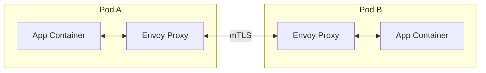
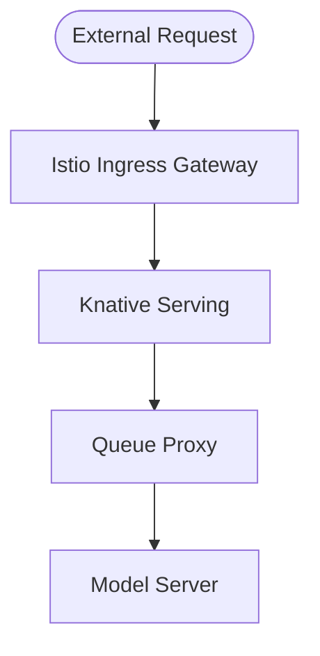

2026-04-26


Tags: [[kubernetes]], [[devops]], [[networking]], [[service-mesh]], [[istio]]

# Istio

> [!info] Istio là một **service mesh** — một infrastructure layer quản lý toàn bộ network traffic giữa các service trong Kubernetes cluster. Thay vì từng service tự xử lý retry, mTLS, observability, Istio đẩy toàn bộ logic đó xuống proxy layer, hoàn toàn transparent với application code.

---

## 1. Vấn đề Istio giải quyết

Trong cluster nhiều service giao tiếp với nhau, các vấn đề phát sinh mà application code không nên tự xử lý:

- Traffic giữa các service có được mã hóa và xác thực không?
- Làm sao retry tự động khi downstream service fail?
- Làm sao đo latency, error rate của từng cặp service mà không cần instrument từng service?
- Làm sao kiểm soát service A có được phép gọi service B không?
- Làm sao canary deploy ở mức network mà không sửa code?

---

## 2. Kiến trúc — Data Plane và Control Plane

### Data Plane — Envoy Sidecar

Istio inject một sidecar container (**Envoy proxy**) vào mỗi pod tự động (thông qua Kubernetes admission webhook). Mọi traffic vào/ra pod đều đi qua Envoy — application container không biết về sự tồn tại của proxy.



### Control Plane — istiod

`istiod` là control plane duy nhất, chịu trách nhiệm:
- **Pilot**: Đẩy routing config xuống tất cả Envoy trong cluster
- **Citadel**: Quản lý certificate, cấp phát và rotate tự động cho mTLS
- **Galley**: Validate và distribute Istio config

```
istiod
  │── đẩy routing rules ──► Envoy (Pod A)
  │── đẩy routing rules ──► Envoy (Pod B)
  └── đẩy certificate   ──► tất cả Envoy
```

---

## 3. Các tính năng chính

### Traffic Management

Istio dùng hai CRD chính để kiểm soát traffic:

- **VirtualService**: Định nghĩa routing rules — request nào đi đâu, với điều kiện gì
- **DestinationRule**: Định nghĩa policy cho destination — load balancing algorithm, connection pool, circuit breaker

**Canary deployment — chia traffic theo tỷ lệ:**

```yaml
apiVersion: networking.istio.io/v1alpha3
kind: VirtualService
metadata:
  name: recommendation-service
spec:
  http:
    - route:
        - destination:
            host: recommendation-svc
            subset: v1
          weight: 90
        - destination:
            host: recommendation-svc
            subset: v2
          weight: 10
```

**Retry và timeout:**

```yaml
http:
  - route:
      - destination:
          host: payment-svc
    retries:
      attempts: 3
      perTryTimeout: 2s
    timeout: 10s
```

**Circuit Breaker** — tự động stop gọi service đang bị lỗi:

```yaml
trafficPolicy:
  outlierDetection:
    consecutive5xxErrors: 5
    interval: 10s
    baseEjectionTime: 30s
```

### Security — mTLS

mTLS (mutual TLS) xác thực hai chiều: service A phải chứng minh danh tính với service B và ngược lại. Istio tự động cấp phát certificate cho mỗi service (dựa trên Kubernetes ServiceAccount) và rotate định kỳ.

```yaml
apiVersion: security.istio.io/v1beta1
kind: PeerAuthentication
metadata:
  name: default
  namespace: production
spec:
  mtls:
    mode: STRICT   # Bắt buộc mTLS cho mọi traffic trong namespace
```

**Authorization Policy — kiểm soát service-to-service:**

```yaml
apiVersion: security.istio.io/v1beta1
kind: AuthorizationPolicy
metadata:
  name: payment-policy
spec:
  selector:
    matchLabels:
      app: payment-svc
  rules:
    - from:
        - source:
            principals: ["cluster.local/ns/prod/sa/order-service"]
      to:
        - operation:
            methods: ["POST"]
            paths: ["/v1/payments"]
```

Chỉ `order-service` (xác định bằng ServiceAccount) mới được gọi `POST /v1/payments` trên `payment-svc`.

### Observability

Envoy tự động collect metrics cho mọi request mà không cần application tự instrument:

- **Metrics**: request count, latency (p50/p95/p99), error rate — export sang Prometheus
- **Distributed tracing**: Propagate trace header (B3, W3C), tích hợp Jaeger/Zipkin
- **Access log**: Log chi tiết từng request qua từng proxy

---

## 4. Istio trong KServe

KServe dùng Istio làm **Ingress Gateway** — điểm vào duy nhất cho traffic từ bên ngoài cluster:



**Vai trò cụ thể của Istio trong KServe:**

| Tính năng KServe | Cơ chế Istio |
|---|---|
| Ingress routing đến InferenceService | `VirtualService` + `Gateway` |
| Canary deployment giữa model revision | `VirtualService` weight-based routing |
| Shadow deployment (mirror traffic) | `VirtualService` mirror config |
| TLS termination ở gateway | Istio Gateway TLS config |
| mTLS giữa các component nội bộ | `PeerAuthentication` STRICT mode |

**Shadow deployment example** — mirror 100% traffic sang model mới mà không trả response về client:

```yaml
http:
  - route:
      - destination:
          host: model-v1
          weight: 100
    mirror:
      host: model-v2   # nhận copy của mọi request, response bị drop
    mirrorPercentage:
      value: 100
```

KServe không bắt buộc Istio — có thể dùng Kourier hoặc Kong làm ingress. Tuy nhiên các tính năng như shadow deployment và fine-grained traffic split sẽ bị giới hạn hoặc không có.

---

## 5. Liên quan

- [[KServe và CRD]] — Istio được dùng làm ingress gateway trong KServe
- [[k8s Services]] — Istio bổ sung thêm layer traffic management lên trên K8s Service
- [[Ingress]] — Istio Gateway là một dạng ingress controller
