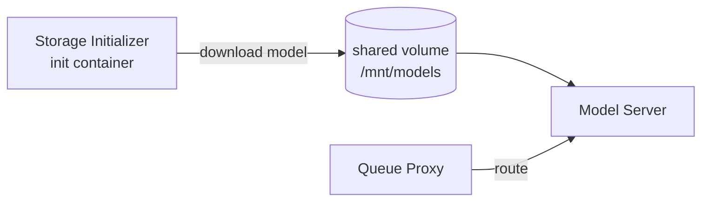

2026-04-26


Tags: [[kubernetes]], [[devops]], [[mlops]], [[infrastructure]]

# KServe và CRD

---

# KServe

KServe là một Kubernetes Custom Resource Definition (CRD) framework để deploy và serve machine learning models trên Kubernetes.

## Kiến trúc cốt lõi

KServe định nghĩa một CRD tên `InferenceService`. Khi tạo một `InferenceService`, KServe controller sinh ra các Kubernetes resource cần thiết để chạy model server.

**Hai chế độ triển khai:**

**Serverless mode** (mặc định) — dùng Knative Serving:
- Model server chạy trên Knative Service
- Scale-to-zero khi không có traffic
- Auto-scaling dựa trên concurrent requests

**RawDeployment mode** — dùng Kubernetes native:
- Model server chạy trên Deployment + Service thông thường
- Không có scale-to-zero
- Phù hợp khi không có Knative

## Các thành phần trong một InferenceService

```
InferenceService
├── Predictor     — container chạy model server (TorchServe, Triton, sklearn, etc.)
├── Transformer   — pre/post processing (optional, gọi Predictor qua gRPC/HTTP)
└── Explainer     — model explainability (optional, dùng Alibi, etc.)
```

Request flow: `Client → Ingress → Transformer → Predictor → Transformer → Client`

## Protocols

KServe hỗ trợ hai inference protocols:

- **V1**: `/v1/models/{model}/predict` — JSON format đơn giản
- **V2 (Open Inference Protocol)**: `/v2/models/{model}/infer` — binary payload, hiệu quả hơn, compatible với Triton và nhiều framework khác

## Model Storage

KServe dùng `Storage Initializer` — một init container chạy trước Predictor, pull model từ:
- S3, GCS, Azure Blob
- PVC
- URI tùy chỉnh

Model được mount vào `/mnt/models` trong Predictor container.

### Cơ chế load model chi tiết

Khi một InferenceService pod khởi động, quá trình diễn ra theo hai giai đoạn:

**Giai đoạn 1 — Init:**



Storage Initializer chạy trước tất cả container khác. Nó pull model từ remote storage và ghi vào shared volume. Model server chưa nhận traffic.

**Giai đoạn 2 — Ready:**

Sau khi Storage Initializer exit với code 0, Kubernetes đánh dấu init container là `Completed` và start các container chính. Model server đọc model từ `/mnt/models`, load vào memory, và Queue Proxy bắt đầu route traffic vào.

```
Pod lifecycle:
  Init containers:  [storage-initializer] → Completed ✓
  Containers:       [queue-proxy] [kserve-container] → Running
```

**Điểm quan trọng:** Storage Initializer exit sau khi download xong là **hành vi đúng** của init container — không phải crash. Kubernetes chỉ báo lỗi nếu init container exit với non-zero code.

## Key Features

| Feature | Mô tả |
|---|---|
| **Scale to/from zero** | Serverless mode dùng Knative — pod scale down về 0 khi không có traffic, scale up khi có request đến |
| **Request batching** | Gom nhiều request lại thành một batch trước khi đưa vào model — tăng throughput, tận dụng GPU hiệu quả hơn |
| **Request-based autoscaling** | Scale số pod dựa trên số concurrent request, áp dụng được cả cho workload CPU lẫn GPU |
| **Request/Response Logging** | Capture toàn bộ inference input/output, gửi vào Knative Eventing broker — dùng cho drift monitoring, audit, retraining data collection |
| **Traffic management** | Chia traffic theo tỷ lệ giữa nhiều model revision (VD: 90% → v1, 10% → v2) — dùng cho canary deployment |
| **Out-of-the-box metrics** | Expose sẵn các Prometheus metrics: request count, latency, queue depth, v.v. |
| **Shadow deployment / A/B testing** | Deploy model mới song song với model đang chạy, mirror traffic vào cả hai nhưng chỉ trả response của model cũ về client — so sánh kết quả mà không ảnh hưởng user |

## Supported Runtimes

KServe có sẵn `ClusterServingRuntime` và `ServingRuntime` CRD để định nghĩa model server. Built-in runtimes:

| Runtime | Framework |
|---|---|
| `kserve-sklearnserver` | scikit-learn |
| `kserve-torchserve` | PyTorch |
| `kserve-tensorflow-serving` | TensorFlow |
| `kserve-tritonserver` | Triton (multi-framework) |
| `kserve-mlserver` | MLflow, XGBoost, sklearn |
| `kserve-huggingfaceserver` | HuggingFace Transformers |

## Dependencies

- Kubernetes ≥ 1.25
- cert-manager (cho webhook TLS)
- Knative Serving (nếu dùng serverless mode)
- Istio hoặc compatible ingress controller

---

# CRD — Custom Resource Definition

Kubernetes có sẵn các resource built-in: `Pod`, `Deployment`, `Service`, `ConfigMap`, v.v. Đây là các object type được Kubernetes API server nhận diện mặc định.

CRD là cơ chế cho phép **đăng ký thêm object type mới** vào Kubernetes API server, ngoài các type built-in.

## Cơ chế hoạt động

Khi apply một CRD manifest, Kubernetes API server:
1. Đọc schema định nghĩa trong CRD
2. Tạo một API endpoint mới, ví dụ: `/apis/serving.kserve.io/v1beta1/inferenceservices`
3. Từ đó `kubectl`, client libraries, và controller có thể CRUD object thuộc type mới này như resource thông thường

CRD chỉ định nghĩa **schema và metadata** của type mới — không định nghĩa behavior.

## Behavior đến từ Controller

Để CRD có tác dụng thực tế, cần một **controller** (operator) chạy trong cluster, liên tục watch API server qua informer/watch loop:

```
API Server ──watch──► Controller
                          │
                    reconcile loop
                          │
                    tạo/xóa/sửa các resource khác
                    (Pod, Deployment, Service, ...)
```

Controller đọc state hiện tại của object, so sánh với desired state trong spec, rồi thực hiện các action để đưa về desired state — đây là **reconciliation loop**.

## Ví dụ với KServe

```
apply InferenceService (CRD instance)
        │
        ▼
KServe Controller nhận event
        │
        ▼
tạo: Knative Service, ConfigMap, ServiceAccount, ...
```

`InferenceService` là CRD. KServe controller là phần xử lý logic khi object đó được tạo/sửa/xóa.

## So sánh Built-in resource vs CRD

| | Built-in resource | CRD |
|---|---|---|
| Định nghĩa | Hardcode trong Kubernetes | Apply manifest vào cluster |
| API endpoint | Có sẵn | Được tạo động sau khi apply CRD |
| Logic xử lý | Trong kube-controller-manager | Trong custom controller (operator) |
