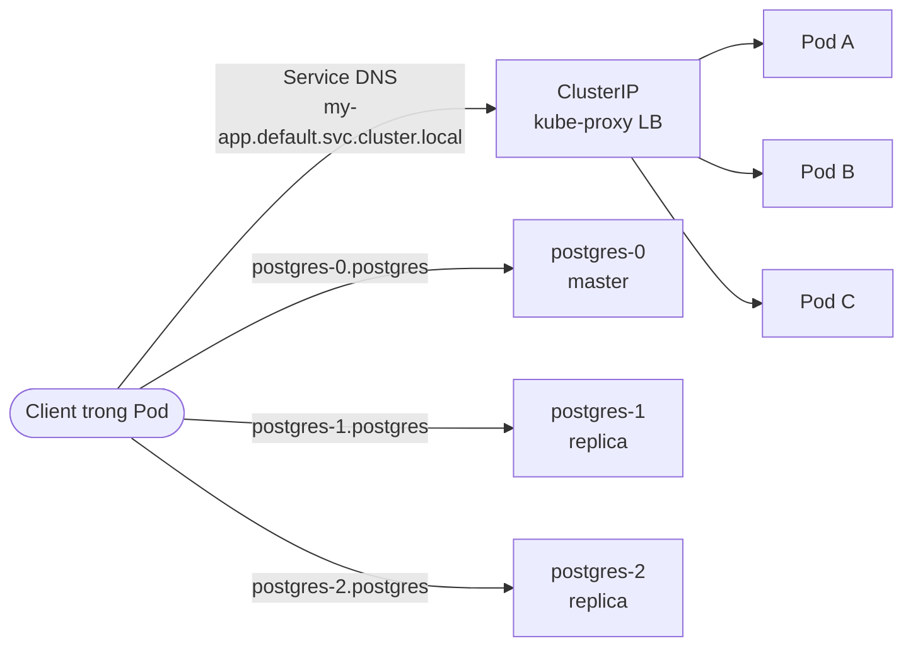

2026-04-30


Tags: [[K8s]], [[devops]], [[CoreDNS]]

# DNS cho Pod và Service trong Kubernetes

> [!info] CoreDNS không chỉ cấp DNS cho Service — **mỗi Pod cũng có DNS record riêng**. Hai loại này khác nhau về mục đích, cú pháp và khi nào dùng. Note này tập trung vào sự khác biệt giữa **DNS-of-Service** và **DNS-of-Pod**, đặc biệt là pattern StatefulSet + headless Service.

Xem thêm note nền: [[k8s Internal DNS - cluster.local]]

---

## 1. DNS cho Service

```
<service-name>.<namespace>.svc.cluster.local
```

- Dùng để **tìm Service** → resolve về ClusterIP (ảo).
- kube-proxy load-balance request sang các Pod backend.
- Pod đến rồi đi (chết, restart, scale) — IP Pod thay đổi liên tục, nhưng Service IP **ổn định**.
- → Đây là cách **chuẩn** để giao tiếp giữa các microservice.

```python
# Gọi service "redis" cùng namespace
r = Redis(host="redis", port=6379)
```

---

## 2. DNS cho Pod

Mỗi Pod cũng có một DNS name, nhưng format **khác**:

```
<pod-ip-with-dashes>.<namespace>.pod.cluster.local
```

Lưu ý:
- IP của Pod được viết **gạch ngang** thay vì chấm: `10.244.1.5` → `10-244-1-5`.
- Phần thứ 3 là `pod` (không phải `svc`).

Ví dụ: Pod có IP `10.244.1.5` ở namespace `default`:

```
10-244-1-5.default.pod.cluster.local
```

```bash
$ kubectl exec -it debug -- nslookup 10-244-1-5.default.pod.cluster.local
Address: 10.244.1.5
```

> [!warning] DNS Pod **gần như không bao giờ dùng trong code app**. Vì IP thay đổi → tên DNS cũng thay đổi → vô dụng cho service discovery. Nó tồn tại chủ yếu cho mục đích nội bộ của K8s và một số case đặc biệt (TLS SAN cho Pod IP).

---

## 3. DNS đặc biệt: Pod thuộc StatefulSet (qua headless Service)

Đây là case **hay dùng nhất** khi cần địa chỉ một Pod cụ thể, không dùng format `pod.cluster.local` xấu xí ở trên mà dùng format đẹp hơn:

```
<pod-name>.<headless-service>.<namespace>.svc.cluster.local
```

### Tại sao?

StatefulSet tạo Pod có tên **ổn định và đánh số**: `mysql-0`, `mysql-1`, `mysql-2`. Khi Pod chết và được tạo lại, **tên giữ nguyên** (dù IP đổi). Kết hợp với **headless Service** (`clusterIP: None`) → mỗi Pod được cấp DNS record riêng có thể địa chỉ trực tiếp.

### Ví dụ: Postgres cluster với 3 replica

```yaml
apiVersion: v1
kind: Service
metadata:
  name: postgres
spec:
  clusterIP: None        # Headless = không có ClusterIP
  selector:
    app: postgres
  ports:
    - port: 5432
---
apiVersion: apps/v1
kind: StatefulSet
metadata:
  name: postgres
spec:
  serviceName: postgres  # Phải khớp tên headless Service
  replicas: 3
  # ...
```

DNS sinh ra:

```
postgres-0.postgres.default.svc.cluster.local  → IP của pod postgres-0
postgres-1.postgres.default.svc.cluster.local  → IP của pod postgres-1
postgres-2.postgres.default.svc.cluster.local  → IP của pod postgres-2

# Đồng thời gọi tên service trần:
postgres.default.svc.cluster.local             → trả về CẢ 3 IP (round-robin)
```

→ Cho phép app: *"Tao muốn nói riêng với Pod số 0 (master)"* hoặc *"Tao muốn list tất cả Pod để form cluster"*.

### Khi nào dùng pattern này?

- **Database cluster**: Postgres, MySQL replication, MongoDB ReplicaSet.
- **Distributed system cần leader election**: Kafka, Zookeeper, etcd, Cassandra.
- **Bất cứ thứ gì cần biết "tao là Pod số mấy"** để khởi tạo state phù hợp.

---

## So sánh 3 loại DNS

| Loại | Format | Resolve về | Dùng khi |
|---|---|---|---|
| **Service DNS** | `<svc>.<ns>.svc.cluster.local` | ClusterIP (ảo, ổn định) | Service-to-service thông thường — **mặc định** |
| **Pod DNS (IP-based)** | `<ip-dashes>.<ns>.pod.cluster.local` | IP Pod cụ thể | Hiếm khi dùng trực tiếp |
| **Pod DNS (StatefulSet)** | `<pod>.<svc>.<ns>.svc.cluster.local` | IP từng Pod cụ thể | Stateful workload (DB, message queue, leader election) |

---

## Sơ đồ trực quan



- Service DNS = **gọi nhóm** (1 trong N Pod, ai rảnh trả lời).
- StatefulSet DNS = **gọi đích danh** Pod nào (Pod-0 là master, gọi cụ thể nó).

---

## Tóm gọn

- **Service DNS** (`*.svc.cluster.local`) = dùng 99% trường hợp, gọi qua ClusterIP để được load-balance.
- **Pod DNS dạng IP** (`*.pod.cluster.local`) = tồn tại nhưng hiếm khi xài.
- **StatefulSet + headless Service DNS** = cách đúng để địa chỉ **từng Pod riêng** khi cần — đặc biệt cho database, message broker, hệ thống phân tán cần leader/replica rõ ràng.

# References
- [[k8s Internal DNS - cluster.local]]
- [[k8s Services]]
- [[k8s Workloads - Deployment, ReplicaSet, StatefulSet, DaemonSet]]
- [[K8s]]
