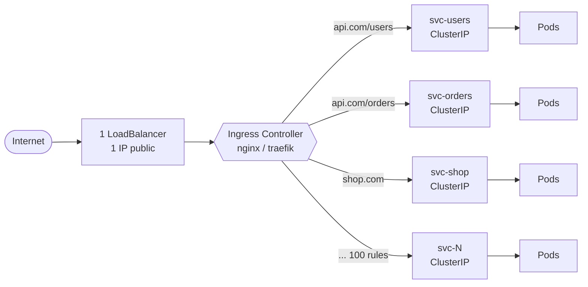
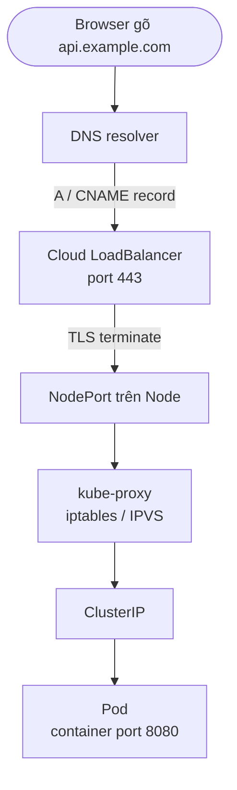

2026-04-30


Tags: [[K8s]], [[devops]], [[Ingress]]

# 3 cách expose Service trong Kubernetes

> [!info] Khác với note [[k8s Services]] (so sánh 3 *type* cơ bản), note này so sánh **3 strategy để expose service ra ngoài** mà ta thực sự gặp khi triển khai production: `NodePort`, `ClusterIP + Ingress`, và `LoadBalancer`.

---

## 1. NodePort

**Cách hoạt động:**
- Kubernetes mở một port cố định (mặc định trong dải `30000-32767`) trên **tất cả các Node** của cluster.
- Traffic đi vào theo đường: `Client → <NodeIP>:<NodePort> → kube-proxy (iptables/IPVS) → Pod`.
- Bên dưới vẫn tự động tạo một ClusterIP để route nội bộ.

```yaml
spec:
  type: NodePort
  ports:
    - port: 80          # ClusterIP port
      targetPort: 8080  # Container port
      nodePort: 30080   # Port mở trên mọi Node
```

**Ưu / Nhược:**
- Đơn giản, không cần cloud provider.
- Port range hạn chế, URL xấu (`:30080`), client phải biết IP của Node.
- Nếu Node chết → client phải tự đổi IP. Không có load balancing trước Node.
- Thường chỉ dùng cho **dev/test** hoặc khi đứng sau một LB tự dựng.

---

## 2. ClusterIP + Ingress

**Cách hoạt động:**
- Service để type mặc định `ClusterIP` → chỉ truy cập được **bên trong cluster** (virtual IP).
- **Ingress** là một resource L7 (HTTP/HTTPS) định nghĩa rules: host, path, TLS → route tới Service nào.
- Phải có **Ingress Controller** chạy trong cluster (nginx, traefik, HAProxy, AWS ALB controller…) để biến Ingress rules thành cấu hình proxy thực tế.
- Đường đi: `Client → LB/DNS → Ingress Controller Pod → ClusterIP Service → Pod`.

```yaml
# Service vẫn là ClusterIP
apiVersion: v1
kind: Service
spec:
  type: ClusterIP
---
apiVersion: networking.k8s.io/v1
kind: Ingress
spec:
  rules:
    - host: api.example.com
      http:
        paths:
          - path: /v1
            backend:
              service: { name: my-svc, port: { number: 80 } }
  tls:
    - hosts: [api.example.com]
      secretName: tls-cert
```

**Ưu / Nhược:**
- 1 entrypoint duy nhất phục vụ **nhiều service** qua host/path → tiết kiệm IP, tiết kiệm LB cloud (đắt).
- Hỗ trợ TLS termination, rewrite, auth, rate-limit ở tầng L7.
- Chỉ tốt cho HTTP/HTTPS (gRPC, websocket OK; TCP/UDP thuần thì hạn chế).
- Phải tự cài và vận hành Ingress Controller.

---

## 3. LoadBalancer

**Cách hoạt động:**
- Khi tạo Service `type: LoadBalancer`, cloud controller (AWS/GCP/Azure…) sẽ provision một **External Load Balancer** thật (NLB/ELB/GLB) với IP công khai.
- LB → forward tới NodePort tự động được tạo trên các Node → kube-proxy → Pod.
- Đường đi: `Client → External LB (Public IP) → NodePort của các Node → Pod`.

```yaml
spec:
  type: LoadBalancer
  ports:
    - port: 80
      targetPort: 8080
```

**Ưu / Nhược:**
- Đơn giản nhất cho production: có IP public, health check, cross-zone, cloud lo hết.
- **Mỗi service = một LB = tốn tiền** (mỗi LB cloud thường tính phí riêng).
- L4 (TCP/UDP) là chính (trừ ALB của AWS), không có routing theo host/path.
- Cần cloud provider hỗ trợ (on-prem phải dùng MetalLB hoặc tương đương).

---

## So sánh nhanh

| Tiêu chí | NodePort | ClusterIP + Ingress | LoadBalancer |
|---|---|---|---|
| Layer | L4 | L7 (HTTP/HTTPS) | L4 (chủ yếu) |
| Entry point | `NodeIP:30000-32767` | 1 LB chung cho nhiều service | 1 LB / 1 service |
| Cần cloud? | Không | Không (cần Ingress Controller) | Có (hoặc MetalLB) |
| Routing host/path | Không | Có | Không |
| TLS termination | Tự lo | Có (sẵn) | Tùy LB |
| Chi phí | Rẻ | Rẻ (1 LB cho nhiều svc) | Đắt (n LB) |
| Use case | Dev/test, đứng sau LB tự dựng | Production HTTP/HTTPS đa service | Production TCP/UDP, hoặc 1 service riêng |

---

## Cách chọn trong thực tế

- **Web app, API HTTP nhiều service** → `ClusterIP + Ingress` (1 LB ngoài + Ingress Controller, tiết kiệm).
- **Service TCP/UDP thuần** (database, game server, gRPC nội bộ) → `LoadBalancer`.
- **Dev/local/CI** → `NodePort` (hoặc `kubectl port-forward`).
- **Production thực tế** thường kết hợp: 1 `LoadBalancer` đứng trước Ingress Controller, các service backend đều `ClusterIP`.

---

## Cảnh báo: 100 app ≠ 100 LoadBalancer

Một câu hỏi rất hay gặp: *"Nếu mỗi LoadBalancer Service tạo ra 1 external IP, thì 100 app nghĩa là 100 IP public?"*

**Mặc định: đúng — và đó chính là vấn đề.**

Nếu bạn tạo 100 Service `type: LoadBalancer`, cloud provider sẽ provision **100 LB thật + 100 IP public** → 100 hóa đơn riêng.

Ví dụ AWS:
- 100 NLB × ~$16/tháng + phí LCU ≈ **$1,600+/tháng** chỉ riêng tiền LB.
- Chưa kể Elastic IP idle cũng tính phí.

Đây chính là **lý do Ingress tồn tại**.

### Cách production thực sự làm: 1 LB cho tất cả

Thay vì 100 LB, dùng **1 LoadBalancer duy nhất** đứng trước **Ingress Controller**:



- **1 IP public duy nhất**, DNS các domain đều trỏ về đó.
- Ingress Controller (nginx/traefik/HAProxy) đọc 100 Ingress resource → biết route nào đi đâu.
- 100 Service backend đều `ClusterIP` → **không tốn LB nào**.
- Chi phí: chỉ 1 LB, không phải 100.

### Khi nào *thực sự* cần nhiều LoadBalancer?

Có những case bắt buộc 1 service = 1 LB:

| Case | Lý do |
|---|---|
| Service **TCP/UDP thuần** (Postgres, Redis, gRPC streaming, game server, MQTT…) | Ingress L7 không xử lý được, phải LB L4 |
| Cần **IP public riêng** (whitelist firewall, compliance) | Mỗi khách hàng yêu cầu IP cố định khác nhau |
| Traffic cực lớn, cần **isolate** từng service | Tránh noisy neighbor trên Ingress Controller dùng chung |
| Protocol đặc biệt (SMTP, SSH, custom binary) | Không phải HTTP |

Còn lại — **HTTP/HTTPS app thông thường** — gần như luôn nên dùng Ingress.

### Tóm gọn

- ❌ 100 app HTTP × `type: LoadBalancer` → 100 IP, đốt tiền vô lý.
- ✅ 100 app HTTP × `ClusterIP` + 100 Ingress rule + 1 Ingress Controller (đứng sau 1 LB) → **1 IP**, rẻ, dễ quản lý TLS/routing.
- ⚠️ Chỉ những service không phải HTTP mới cần `LoadBalancer` riêng.

---

## Cấu hình domain cho LoadBalancer

Bản chất: LoadBalancer cấp cho bạn 1 **IP public** (hoặc DNS name của cloud, kiểu `a1b2c3.elb.amazonaws.com`). Để truy cập bằng domain đẹp như `api.example.com` thay vì IP + port, cần **DNS record** trỏ domain → LB, và LB **lắng nghe trên port 80/443**.

### Bước 1: Lấy địa chỉ của LoadBalancer

```bash
kubectl get svc my-app
```

```
NAME     TYPE           CLUSTER-IP      EXTERNAL-IP                          PORT(S)
my-app   LoadBalancer   10.96.10.20     a1b2c3.us-east-1.elb.amazonaws.com   80:30080/TCP
```

`EXTERNAL-IP` có thể là:
- **IP** (GCP, Azure, MetalLB) → `34.120.5.10`
- **DNS hostname** (AWS ELB/NLB) → `a1b2c3...elb.amazonaws.com`

### Bước 2: Cấu hình LB lắng nghe đúng port

Để client gõ `https://api.example.com` không kèm port, LB phải mở **80 (HTTP)** và **443 (HTTPS)**:

```yaml
apiVersion: v1
kind: Service
metadata:
  name: my-app
spec:
  type: LoadBalancer
  selector:
    app: my-app
  ports:
    - name: http
      port: 80          # Port LB mở ra ngoài
      targetPort: 8080  # Port container
    - name: https
      port: 443
      targetPort: 8080
```

> [!warning] `port` ở đây là port **LB phơi ra Internet**, không phải port Pod. Đừng nhầm với NodePort `:30xxx` — đó là port nội bộ của Node, client không cần biết.

### Bước 3: Tạo DNS record

Tùy `EXTERNAL-IP` là IP hay hostname:

**Trường hợp 1 — External-IP là IP** (GCP, Azure, MetalLB): Vào DNS provider (Cloudflare, Route53, GoDaddy…) tạo:

```
Type: A
Name: api          (→ thành api.example.com)
Value: 34.120.5.10
TTL: 300
```

**Trường hợp 2 — External-IP là DNS name** (AWS): Không dùng A record được vì IP của ELB **thay đổi**. Dùng `CNAME` (hoặc Route53 Alias):

```
Type: CNAME
Name: api
Value: a1b2c3.us-east-1.elb.amazonaws.com
```

Nếu dùng Route53 + cùng AWS account → tạo **Alias record** (miễn phí, hỗ trợ apex domain `example.com`):

```
Type: A (Alias)
Name: api.example.com
Alias target: a1b2c3.us-east-1.elb.amazonaws.com
```

### Bước 4: Kiểm tra DNS

```bash
dig api.example.com +short
# hoặc
nslookup api.example.com
```

Kết quả phải trả về đúng IP/hostname của LB. DNS có thể mất 1–5 phút để propagate.

```bash
curl http://api.example.com
# Nếu OK → traffic đã chạy: Browser → DNS → LB → Node → Pod
```

### Bước 5: HTTPS (TLS)

Domain trần `http://` không đủ — production cần `https://`. Có 3 cách phổ biến:

**Cách A — TLS termination ở LB (cloud-managed cert)**

Để cloud (AWS ACM, GCP Managed Cert) tự lo TLS. Dùng annotation:

```yaml
metadata:
  annotations:
    service.beta.kubernetes.io/aws-load-balancer-ssl-cert: arn:aws:acm:...:certificate/xxx
    service.beta.kubernetes.io/aws-load-balancer-backend-protocol: http
    service.beta.kubernetes.io/aws-load-balancer-ssl-ports: "443"
spec:
  type: LoadBalancer
  ports:
    - { name: http,  port: 80,  targetPort: 8080 }
    - { name: https, port: 443, targetPort: 8080 }
```

LB nhận HTTPS từ Internet → giải mã → forward HTTP nội bộ tới Pod.

**Cách B — TLS termination tại Pod**

Pod tự load cert (Secret) và chạy HTTPS. LB chỉ pass-through TCP. Phức tạp hơn, ít dùng.

**Cách C (khuyên dùng) — Đặt Ingress trước, dùng cert-manager**

Đây là pattern chuẩn: 1 LoadBalancer trước Ingress Controller, cert-manager tự xin và renew Let's Encrypt:

```yaml
apiVersion: networking.k8s.io/v1
kind: Ingress
metadata:
  annotations:
    cert-manager.io/cluster-issuer: letsencrypt-prod
spec:
  tls:
    - hosts: [api.example.com]
      secretName: api-tls
  rules:
    - host: api.example.com
      http:
        paths:
          - path: /
            pathType: Prefix
            backend:
              service: { name: my-app, port: { number: 80 } }
```

Lúc này Service `my-app` chỉ cần là `ClusterIP` — không tốn LB riêng.

### Tự động hóa: ExternalDNS

Thay vì vào DNS provider tạo record bằng tay mỗi lần deploy, cài [external-dns](https://github.com/kubernetes-sigs/external-dns) → nó **đọc** Service/Ingress trong cluster và **tự tạo/cập nhật DNS record** ở Route53/Cloudflare/GCP DNS.

```yaml
metadata:
  annotations:
    external-dns.alpha.kubernetes.io/hostname: api.example.com
```

Triển khai 100 service → 100 DNS record tự sinh, không động tay.

### Tóm tắt luồng



3 thứ phải khớp:
1. **Service** mở port 80/443 đúng `targetPort` của container.
2. **DNS record** trỏ đúng `EXTERNAL-IP`.
3. **TLS cert** match đúng domain (nếu dùng HTTPS).

# References
- [[k8s Services]]
- [[Ingress]]
- [[K8s]]
