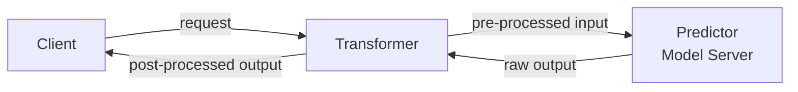
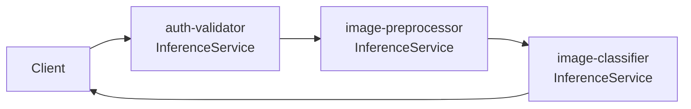

2026-04-26


Tags: [[kserve]], [[mlops]], [[kubernetes]], [[inference]]

# KServe — Extra Steps: Transformer và Inference Graph

> [!info] Ngoài việc chạy model inference thuần túy, KServe cung cấp hai cơ chế để thêm logic xử lý phụ trợ vào pipeline: **Transformer Layer** (gắn trong một InferenceService) và **Inference Graph** (kết nối nhiều InferenceService thành pipeline).

Các extra step phổ biến cần thêm vào:
- **Authenticating**: Xác thực request trước khi cho phép gọi model
- **Pre-processing**: Normalize, resize ảnh, tokenize text, v.v. trước khi đưa vào model
- **Post-processing**: Threshold, format lại response, filter kết quả sau khi model trả về

---

## 1. Transformer Layer

Transformer là một component tùy chọn trong `InferenceService`, chạy như một container riêng nằm giữa client và Predictor.



Khi request đến, Transformer intercept, chạy pre-processing logic, forward sang Predictor. Khi nhận được kết quả, Transformer chạy post-processing rồi trả về client. Toàn bộ nằm trong cùng một `InferenceService`.

**Định nghĩa trong manifest:**

```yaml
apiVersion: serving.kserve.io/v1beta1
kind: InferenceService
metadata:
  name: image-classifier
spec:
  transformer:
    containers:
      - image: your-registry/preprocess-image:v1
        name: transformer
  predictor:
    model:
      modelFormat:
        name: pytorch
      storageUri: s3://your-bucket/model
```

**Giao tiếp giữa Transformer và Predictor:** Transformer gọi Predictor qua HTTP hoặc gRPC nội bộ. KServe inject địa chỉ Predictor vào env variable của Transformer container (`PREDICTOR_HOST`).

**Phù hợp khi:**
- Pre/post processing logic gắn chặt với một model cụ thể
- Không cần tái sử dụng logic này cho model khác
- Pipeline đơn giản: một input, một model, một output

---

## 2. Inference Graph

`InferenceGraph` là một CRD riêng của KServe cho phép kết nối nhiều `InferenceService` thành một pipeline có cấu trúc. Mỗi node trong graph là một bước xử lý.

**Bốn loại node:**

| Node type | Hành vi |
|---|---|
| `Sequence` | Gọi các service tuần tự — output của service trước là input của service sau |
| `Switch` | Route request đến service khác nhau dựa trên soft/header condition |
| `Ensemble` | Gọi nhiều service song song, aggregate kết quả (VD: average probability) |
| `Splitter` | Chia traffic theo tỷ lệ giữa các service |

**Ví dụ — Sequence pipeline:**

App nhận ảnh từ user, cần: (1) xác thực ảnh hợp lệ, (2) pre-process, (3) classify.

```yaml
apiVersion: serving.kserve.io/v1alpha1
kind: InferenceGraph
metadata:
  name: image-pipeline
spec:
  nodes:
    root:
      routerType: Sequence
      steps:
        - serviceName: auth-validator      # bước 1: validate
        - serviceName: image-preprocessor  # bước 2: pre-process
        - serviceName: image-classifier    # bước 3: classify
```



**Ví dụ — Ensemble:**

Gọi hai model song song, average kết quả để tăng độ chính xác:

```yaml
root:
  routerType: Ensemble
  steps:
    - serviceName: model-v1
    - serviceName: model-v2
```

---

## 3. So sánh hai cách

| | Transformer Layer | Inference Graph |
|---|---|---|
| Scope | Trong một InferenceService | Nhiều InferenceService |
| Cấu trúc | Linear (pre → model → post) | Flexible (sequence, switch, ensemble, split) |
| Tái sử dụng logic | Không — gắn với một model | Có — mỗi node là service độc lập |
| Độ phức tạp | Thấp | Cao hơn |
| Phù hợp | Processing đơn giản, gắn với model | Pipeline phức tạp, multi-model, routing |

---

## 4. Liên quan

- [[KServe và CRD]] — kiến trúc tổng quan của KServe và InferenceService
- [[Model Serving Patterns]] — model-as-service vs model-as-dependency
