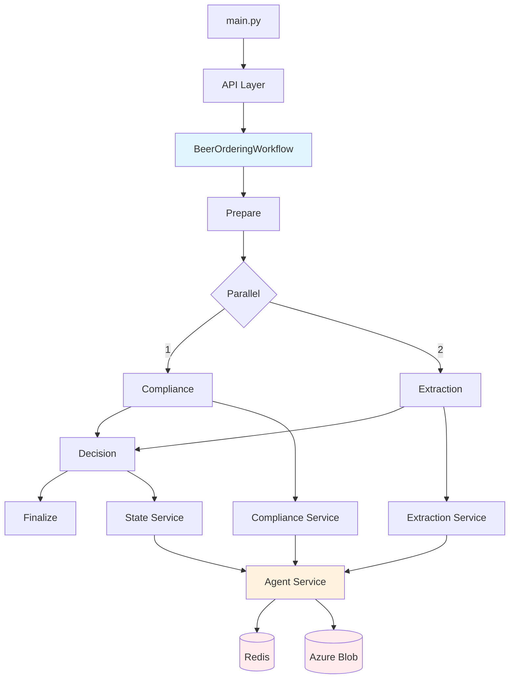

2026-01-19 14:20

Tags: [[TigerTribe]], [[HNK-SMARTAP-BREWBUDDY]]

# Overview Architecture

```mermaid
graph TD
    Main[main.py] --> API[API Layer]
    API --> Workflow[BeerOrderingWorkflow]
    
    Workflow --> Prepare[Prepare]
    Prepare --> Parallel{Parallel}
    Parallel -->|1| Compliance[Compliance]
    Parallel -->|2| Extract[Extraction]
    
    Compliance --> Decision[Decision]
    Extract --> Decision
    Decision --> Finalize[Finalize]
    
    Compliance --> CompSvc[Compliance Service]
    Extract --> ExtrSvc[Extraction Service]
    Decision --> StateSvc[State Service]
    
    CompSvc --> Agent[Agent Service]
    ExtrSvc --> Agent
    StateSvc --> Agent
    
    Agent --> Redis[(Redis)]
    Agent --> Blob[(Azure Blob)]
    
    style Workflow fill:#e1f5fe
    style Agent fill:#fff3e0
    style Redis fill:#ffebee
    style Blob fill:#ffebee
```
 

# References
