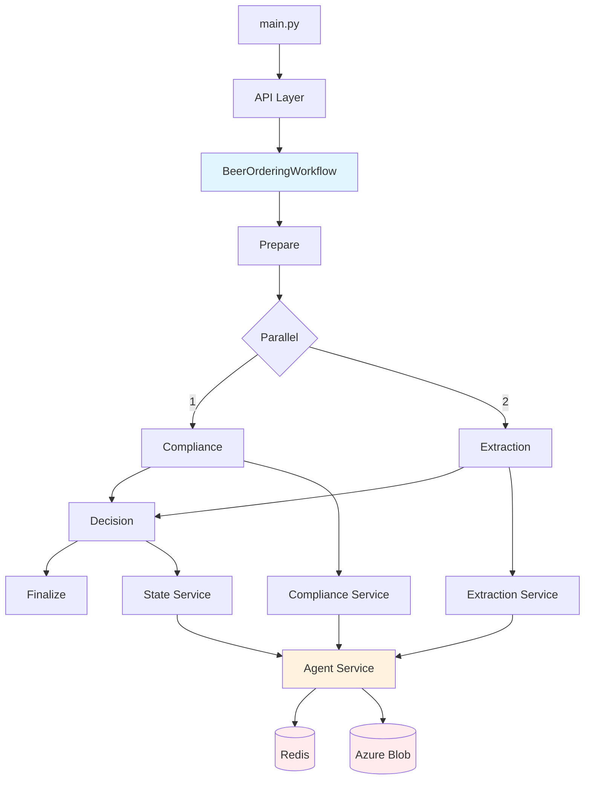
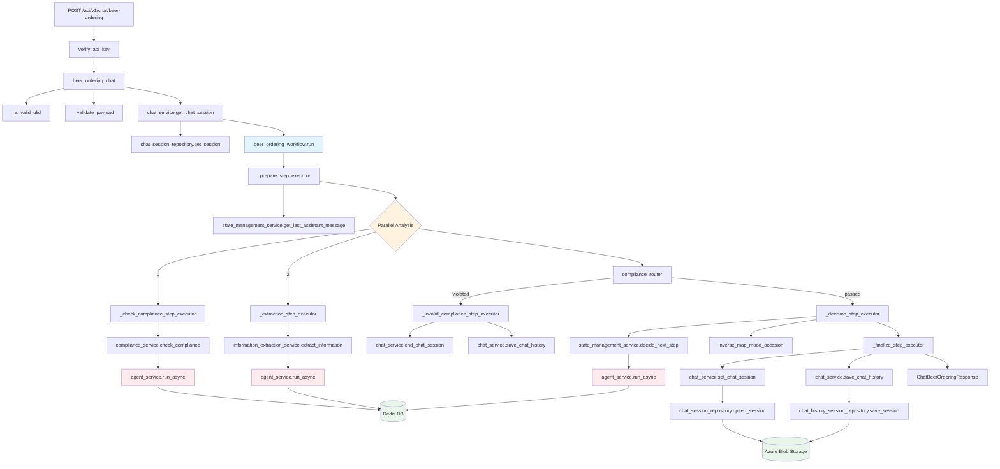

2026-01-19 14:20


Tags: [[TigerTribe]], [[HNK-SMARTAP-BREWBUDDY]]

# Overview Architecture



## Detailed Workflow with Classes/Methods Mapping:




- Vị trí chính xác trong repo:
```python
beer_ordering_chat() → app/api/chat.py:48

_is_valid_ulid() → app/api/chat.py:191

_validate_payload() → app/api/chat.py:198

get_chat_session() → app/services/chat_services/chat_service.py:26
 beer_ordering_workflow.run() → app/services/workflows/beer_ordering_workflow.py:67

_prepare_step_executor() → app/services/workflows/beer_ordering_workflow.py:124
 _check_compliance_step_executor() → app/services/workflows/beer_ordering_workflow.py:164
 _extraction_step_executor() → app/services/workflows/beer_ordering_workflow.py:180

check_compliance() → app/services/chat_services/compliance_service.py:17

extract_information() → app/services/chat_services/information_extraction.py:20

compliance_router() → app/services/workflows/beer_ordering_workflow.py:407

 _decision_step_executor() → app/services/workflows/beer_ordering_workflow.py:198

decide_next_step() → app/services/chat_services/state_management.py:39

 _finalize_step_executor() → app/services/workflows/beer_ordering_workflow.py:332

set_chat_session() → app/services/chat_services/chat_service.py:51

save_chat_history() → app/services/chat_services/chat_service.py:114
```


### Workflow:

1. Trigger Workflow:
	- Sau khi `beer_ordering_chat (API)` thực hiện xong validate và lấy session state.
	- Hàm` BeerOrderingWorkflow.run()` được gọi.
	- `self.workflow.arun()` kích hoạt workflow engine.
2. Execution Chain:
	- Bước 1: *prepare_step*: (`_prepare_step_executor`): Chuẩn bị input, merge state hiện tại và request mới.
	- Bước 2: Parallel:
		- *compliance_step*: (`_check_compliance_step_executor`): Kiểm tra compliance -> gọi `compliance_service.check_compliance `  -> Trả về `compliance_result`.
		- *extraction_step*: (`_extraction_step_executor`): Trích xuất thông tin (mood, flavor, etc.) -> Trả về `extracted_info`.
	- Bước 3: Router:
		- `compliance_router`: Nhận input từ Parallel trước đó.
		- Kiểm tra `compliance_result.`
		- Nếu Vi phạm (`is_violated`): -> Gọi i`nvalid_compliance_step`.
		- Nếu An toàn: -> Gọi `decision_step`.
3. Violation Path:
	- invalid_compliance_step (_invalid_compliance_step_executor):
	- Lưu lịch sử chat.
	- Kết thúc session (`end_chat_session`).
	- Trả về response với `renderingType="chat-terminated"`.
4. Happy Path - Decision:
	- decision_step (_decision_step_executor):
		- Tổng hợp kết quả từ extraction và compliance.
		- Cập nhật logic nghiệp vụ (ví dụ: state mapping, intent count).
		- Gọi AI (`state_management_service`) để quyết định câu trả lời tiếp theo.
	- finalize_step (_finalize_step_executor):
		- Lưu state mới vào DB.
		- Trả về response cuối cùng cho API.


### Services 

1. **check_compliance()**: sử dụng AI để *detect compliance*, *detect out of scope contents*, *detect clarifications that reset previous violations*
- Flow chi tiết: 
	- Nhận vào context: (`user_message`, `lang`, `session_id`, và `previous_ai_message`. - nếu không có `previous_ai_message` thì tự động gán 1 câu mặc định)
	- Build prompt: Gồm `System_prompt` và `User_prompt`
	```python
	system_prompt = COMPLIANCE_CHECK_SYSTEM_PROMPT
	user_prompt = prompt_service.format_user_prompt(
	COMPLIANCE_CHECK_USER_PROMPT,
	user_message=user_message,
	previous_ai_message=previous_ai_message,
	)
	```
	- Gọi AI từ Azure OpenAI: 
```python
response = (
	await self.agent_service.with_messages(        #gửi request đến LLM
	[{"role": "user", "content": user_prompt}] 
	)
	.with_system_prompt(system_prompt)
	.with_session_id(session_id)
	# yêu cầu trả về theo ComplianceCheckResponse
	.with_response_model(ComplianceCheckResponse)  
	.run_async()
)
```
- 
	- Nếu kết quả trả về đúng định dạng `ComplianceCheckResponse`, sử dụng trực tiếp.
	- Nếu kết quả là chuỗi text (do lỗi định dạng), hàm `_parse_response` sẽ cố gắng parse JSON từ chuỗi đó một cách thủ công (fallback mechanism). 
	- Log warning nếu phát hiện vi phạm (`is_violated=True`) hoặc thông tin nếu an toàn.
	- Trả về object ComplianceCheckResponse chứa: `is_violated, violation_type, message, reasoning.`

2. *extract_information*: 
# References
