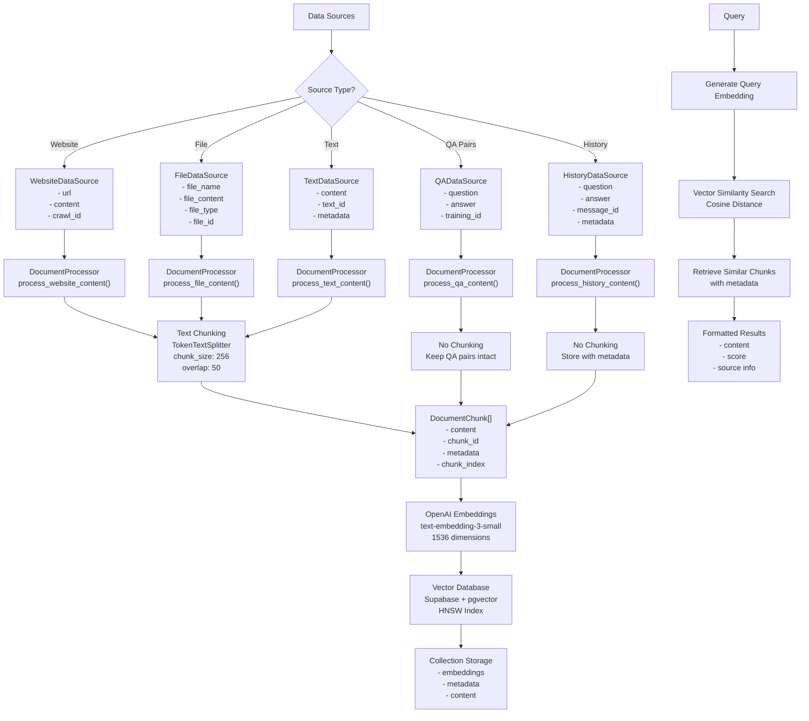

# RAG (Retrieval Augmented Generation) System

  

The RAG system allows processing and storing various types of data sources, then performs semantic search to support question answering and content generation.

  

## 🏗️ System Architecture

  

### Main Components

  

1. **DocumentProcessor**: Process and chunk documents

2. **VectorDBManager**: Manage vector database

3. **OpenAIEmbeddings**: Generate embeddings from OpenAI

4. **AgentDataPipeline**: Overall pipeline for data processing

  

### Technologies Used

  

- **Vector Database**: Supabase with pgvector

- **Embeddings**: OpenAI text-embedding-3-small (1536 dimensions)

- **Text Splitting**: LangChain TokenTextSplitter

- **Index**: HNSW (Hierarchical Navigable Small World)

- **Distance Metric**: Cosine Distance

  

## 📁 Supported Data Source Types

  

### 1. Website Content

```python

WebsiteDataSource(

url="https://example.com",

content="Crawled website content",

crawl_id=uuid4() # Optional

)

```

  

### 2. File Upload

```python

FileDataSource(

file_name="document.pdf",

file_content="File content (string or bytes)",

file_type="application/pdf",

file_id=uuid4() # Optional

)

```

  

### 3. Direct Text

```python

TextDataSource(

content="Direct text content",

text_id="unique_text_id",

metadata={"custom": "data"} # Optional

)

```

  

### 4. Question-Answer Pairs

```python

QADataSource(

question="Training question",

answer="Corresponding answer",

training_id="unique_qa_id",

metadata={"category": "FAQ"} # Optional

)

```

  

### 5. Chat History Training

```python

HistoryDataSource(

question="User question from chat",

answer="AI response from chat",

training_id="unique_history_id",

message_id="unique_message_id", # Required for updating/tracking

metadata={

"history_summary": "Context of the conversation",

"train_type": "conversation",

"created_at": "2024-03-21T10:00:00"

}

)

```

  

## 🔄 Data Processing Flow

  

### 1. Input Processing

- Receive data from API endpoints

- Validate schema according to Pydantic models

- Convert format if needed (bytes → string)

  

### 2. Document Processing

- **Website/File/Text**: Split into chunks (256 tokens, overlap 50)

- **QA Pairs**: Keep intact without chunking to preserve semantics

- **History**: Store complete question-answer pairs with context

  

### 3. Embedding Generation

- Use OpenAI API to generate embeddings

- Model: text-embedding-3-small

- Dimension: 1536

- Retry logic with exponential backoff

  

### 4. Vector Storage

- Store in Supabase with pgvector

- Create HNSW index for fast search

- Metadata is stored alongside for information retrieval

- For history data, maintains message_id for updates

  

### 5. Query & Retrieval

- Generate embedding for query

- Search similarity with cosine distance

- Return results with score and metadata

- Optional document threshold filtering

  

## 🚀 API Endpoints

  

### Process Data

  

#### Process Websites

```bash

POST /process_agent_websites

{

"collection_name": "my_agent_data",

"websites": [

{

"url": "https://example.com",

"content": "Website content...",

"crawl_id": "uuid-string"

}

]

}

```

  

#### Process Files

```bash

POST /process_agent_files

{

"collection_name": "my_agent_data",

"files": [

{

"file_name": "document.txt",

"file_content": "File content...",

"file_type": "text/plain",

"file_id": "uuid-string"

}

]

}

```

  

#### Process Texts

```bash

POST /process_agent_texts

{

"collection_name": "my_agent_data",

"texts": [

{

"content": "Direct text content...",

"text_id": "unique_id",

"metadata": {"custom": "data"}

}

]

}

```

  

#### Process History

```bash

POST /process_agent_history

{

"collection_name": "my_agent_data",

"history": [

{

"question": "User question",

"answer": "AI response",

"training_id": "unique_id",

"message_id": "chat_message_id",

"metadata": {

"history_summary": "Conversation context",

"train_type": "conversation",

"created_at": "2024-03-21T10:00:00"

}

}

]

}

```

  

### Delete Data

  

#### Delete by Source ID

```bash

DELETE /delete_data_by_source?collection_name=my_agent_data&source_id=uuid&source_type=file

```

  

#### Delete by Source Type

```bash

DELETE /delete_data_by_source_type?collection_name=my_agent_data&source_type=web

```

  

#### Delete by Message ID (History)

```bash

DELETE /delete_data_by_message?collection_name=my_agent_data&message_id=chat_message_id

```

  

## 📊 Response Format

  

### Success Response

```json

{

"status": "success",

"collection_name": "my_agent_data",

"chunk_ids": ["chunk1", "chunk2", "..."],

"message": "Added 10 chunks to collection my_agent_data"

}

```

  

### Error Response

```json

{

"status": "partial_success",

"collection_name": "my_agent_data",

"chunk_ids": ["chunk1", "chunk2"],

"message": "Added 2 chunks to collection my_agent_data with 1 errors",

"errors": [

{

"message": "Error details",

"file_name": "problematic_file.pdf"

}

]

}

```

  

## ⚙️ Configuration

  

### Environment Variables

```bash

OPENAI_API_KEY=your_openai_api_key

SUPABASE_URL=your_supabase_url

SUPABASE_DB_PASSWORD=your_db_password

EMBEDDING_DIMENSION=1536 # Optional, defaults to 1536

```

  

### Default Settings

- **Chunk Size**: 256 tokens

- **Chunk Overlap**: 50 tokens

- **Embedding Model**: text-embedding-3-small

- **Vector Dimensions**: 1536

- **Index Type**: HNSW

- **Distance Metric**: Cosine Distance

- **HNSW Configuration**:

- `ef_construction`: 64

- `m`: 16

  

## 🔍 Query Examples

  

### Basic Query

```python

pipeline = AgentDataPipeline()

results = await pipeline.vector_db_manager.query_collection(

collection_name="my_agent_data",

query_text="Find product information",

limit=5,

document_threshold=0.8 # Optional similarity threshold

)

```

  

### Query Result Structure

```python

[

{

"id": "chunk_id",

"score": 0.123, # Cosine distance (lower = more similar)

"content": "Chunk content...",

"source_type": "file",

"source_id": "file_uuid",

"metadata": {

"chunk_index": 0,

"content_type": "text/plain",

"created_at": "2024-01-01T00:00:00",

"full_content": "Full content..."

}

}

]

```

  

### History Query Result

```python

[

{

"id": "chunk_id",

"score": 0.123,

"content": "User question",

"metadata": {

"question": "Original question",

"answer": "AI response",

"training_id": "unique_id",

"message_id": "chat_message_id",

"history_summary": "Conversation context",

"train_type": "conversation",

"created_at": "2024-03-21T10:00:00"

}

}

]

```

  

## 🛠️ Error Handling

  

### Common Issues

  

1. **Encoding Errors**: Automatic fallback encoding for files

2. **Empty Content**: Skip and log warning

3. **API Rate Limits**: Retry with exponential backoff

4. **Connection Issues**: Auto-disconnect after operations

5. **Duplicate History**: Auto-replace based on message_id

  

### Optimizations

- Batch processing for multiple files

- Async operations with gather()

- Connection pooling

- HNSW index for fast retrieval

- Message-based history updates

  
  

