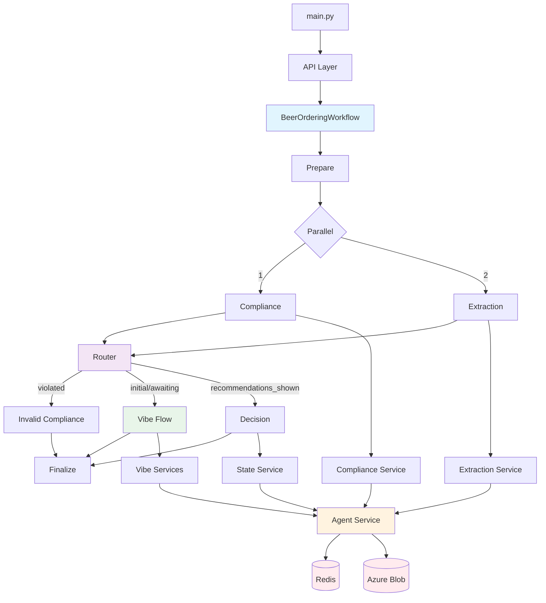
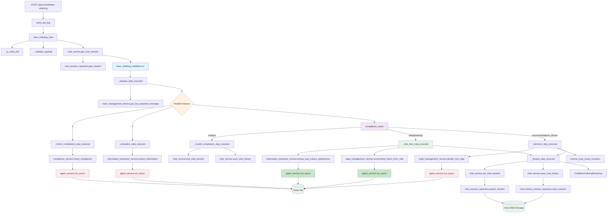

2026-01-19 14:20 (Updated with Vibe Flow)
  

Tags: [[TigerTribe]], [[HNK-SMARTAP-BREWBUDDY]]

  

# Overview Architecture

  



  

## Detailed Workflow with Classes/Methods Mapping:

  



  
  

- Vị trí chính xác trong repo:

```python

beer_ordering_chat() → app/api/chat.py:48

  

_is_valid_ulid() → app/api/chat.py:191

  

_validate_payload() → app/api/chat.py:198

  

get_chat_session() → app/services/chat_services/chat_service.py:26

beer_ordering_workflow.run() → app/services/workflows/beer_ordering_workflow.py:67

  

_prepare_step_executor() → app/services/workflows/beer_ordering_workflow.py:124

_check_compliance_step_executor() → app/services/workflows/beer_ordering_workflow.py:164

_extraction_step_executor() → app/services/workflows/beer_ordering_workflow.py:180

_vibe_flow_step_executor() → app/services/workflows/beer_ordering_workflow.py:204 (NEW)

  

check_compliance() → app/services/chat_services/compliance_service.py:17

check_out_of_scope() → app/services/chat_services/compliance_service.py:89 (NEW)

  

extract_information() → app/services/chat_services/information_extraction.py:20

extract_pop_culture_preferences() → app/services/chat_services/information_extraction.py:133 (NEW)

  

compliance_router() → app/services/workflows/beer_ordering_workflow.py:550

  

_invalid_compliance_step_executor() → app/services/workflows/beer_ordering_workflow.py:600

_decision_step_executor() → app/services/workflows/beer_ordering_workflow.py:289

  

decide_next_step() → app/services/chat_services/state_management.py:39

recommend_beers_from_vibe() → app/services/chat_services/state_management.py:122 (NEW)

  

_finalize_step_executor() → app/services/workflows/beer_ordering_workflow.py:478

  

set_chat_session() → app/services/chat_services/chat_service.py:51

save_chat_history() → app/services/chat_services/chat_service.py:114

```

  

- System Prompts mới:

```python

POP_CULTURE_EXTRACTION_PROMPT → app/systemprompt/pop_culture_extraction_system.py (NEW)

BEER_RECOMMENDATION_PROMPT → app/systemprompt/beer_recommendation_system.py (NEW)

OUT_OF_SCOPE_DETECTION_PROMPT → app/systemprompt/out_of_scope_detection_system.py (NEW)

```

  
  

### Workflow:

  

1. Trigger Workflow:

- Sau khi `beer_ordering_chat (API)` thực hiện xong validate và lấy session state.

- Hàm` BeerOrderingWorkflow.run()` được gọi.

- `self.workflow.arun()` kích hoạt workflow engine.

2. Execution Chain:

- Bước 1: *prepare_step*: (`_prepare_step_executor`): Chuẩn bị input, merge state hiện tại và request mới.

- Bước 2: Parallel:

- *compliance_step*: (`_check_compliance_step_executor`): Kiểm tra compliance -> gọi `compliance_service.check_compliance ` -> Trả về `compliance_result`.

- *extraction_step*: (`_extraction_step_executor`): Trích xuất thông tin (mood, flavor, etc.) -> Trả về `extracted_info`.

- Bước 3: Router:

- `compliance_router`: Nhận input từ Parallel trước đó.

- Kiểm tra `compliance_result.`

- Nếu Vi phạm (`is_violated`): -> Gọi `invalid_compliance_step`.

- Nếu An toàn: Kiểm tra `conversation_stage` từ `current_state`:

- Nếu `stage in ["initial", "awaiting_preferences"]`: -> Gọi `vibe_flow_step` (Flow mới: Vibe-Based Recommendations)

- Nếu `stage == "recommendations_shown"`: -> Gọi `decision_step` (Flow cũ: Traditional step-by-step)

- Các stage khác: -> Gọi `decision_step` (Default)

3. Violation Path:

- invalid_compliance_step (_invalid_compliance_step_executor):

- Lưu lịch sử chat.

- Kết thúc session (`end_chat_session`).

- Trả về response với `renderingType="chat-terminated"`.

  

4. Happy Path - Two Flows:

  

**4a. Vibe Flow (New - For Initial Recommendations):**

- vibe_flow_step (`_vibe_flow_step_executor`):

- **Step 1**: Extract vibe từ user message:

- Gọi `information_extraction_service.extract_pop_culture_preferences()`

- Trích xuất: movies, music, food, colors, energy_level, social_context, mood_essence

- Hỗ trợ cả pop culture references (The Office, jazz, pizza) và mood/occasion descriptions (feeling blue, night walk)

- **Step 2**: Generate beer recommendations:

- Gọi `state_management_service.recommend_beers_from_vibe()`

- AI tạo 3 beer recommendations với intensity và ABV đã được chọn sẵn

- Format message với opening_message và 3 beers (beer_name, intensity, abv, personality_link, bartender_note)

- **Step 3**: Update state:

- Set `conversation_stage = "recommendations_shown"`

- Reset `intent_count = 0`

- Return `renderingType = "chat-only"` với recommendations message

- **Ưu điểm**: User chỉ cần mô tả vibe một lần → Nhận ngay 3 options → Chọn một → Confirm (nhanh hơn flow cũ)

  

**4b. Decision Flow (Traditional - For Order Handling):**

- decision_step (`_decision_step_executor`):

- Tổng hợp kết quả từ extraction và compliance.

- Cập nhật logic nghiệp vụ (ví dụ: state mapping, intent count).

- Xử lý recommendation list selection: Nếu user chọn "first option" từ recommendations → Extract flavor, intensity, ABV từ list

- Code-level override: Nếu tất cả selections đã đầy đủ nhưng LLM vẫn hỏi thêm → Override thành `order-ensure-confirmation`

- Gọi AI (`state_management_service.decide_next_step`) để quyết định câu trả lời tiếp theo.

- **Sử dụng khi**: User đã thấy recommendations và đang chọn/confirm order

  

5. Finalize Step:

- finalize_step (`_finalize_step_executor`):

- **Lưu State**: Lưu session state mới nhất (bao gồm `conversation_stage`) vào Azure Blob Storage.

- **Lưu History**: Lưu lịch sử chat vào Azure Blob Storage.

- **Format Response**: Tạo object `ChatBeerOrderingResponse` để trả về cho API.

  
  

Note về `_decision_step_executor`:

- **Logic "Intent Count" & "Surprise Me"**

```python

if extracted_info.intent_score <= 0.4:

new_intent_count = stored_state.intent_count + 1 # Tăng đếm nếu ý định ko rõ ràng

else:

new_intent_count = 0 # Reset nếu người dùng nói rõ ý định

  

if new_intent_count >= 2 and extracted_info.flavor is None:

extracted_info.surpriseMe = True # Tự động bật Surprise Me

new_intent_count = 0

```

  

- Mục đích: Tránh việc AI hỏi đi hỏi lại mãi mà người dùng vẫn trả lời vòng vo.

- Nếu người dùng trả lời không rõ ràng (`intent_score <= 0.4`) 2 lần liên tiếp (`new_intent_count >= 2`), hệ thống sẽ tự động chuyển sang chế độ `surpriseMe` để gợi ý luôn cho nhanh

  

- **Inverse Mapping**:

```python

extracted_info = self.inverse_map_mood_occasion(

current_state=extracted_info,

mapping_data=request.mappingData.mappings,

)

```

- Logic: Nếu người dùng chọn bia (flavor) trước khi chọn mood/occasion.

- Hàm này sẽ tra ngược từ bia ra `mood `và `occasion` tương ứng trong file config (`mappingData`) và tự động điền vào state. Giúp người dùng không phải trả lời lại những câu hỏi thừa.

  

- **Decision**:

```python

decision: StateDecision = await self.state_management_service.decide_next_step(

user_message=request.message,

extracted_info=extracted_info,

lang=request.lang,

session_id=request.sessionId,

component_type=request.mappingData.componentsByType,

mappings=request.mappingData.mappings,

)

```

- `StateManagementService` sẽ dùng AI để quyết định xem:

- Hệ thống nên nói câu gì với người dùng (`decision.message`)?

- Frontend nên hiển thị giao diện gì (`decision.renderingType`)? (Ví dụ: hiện bảng chọn mood, hay hiện nút xác nhận đơn hàng).

  
  

### Services

  

1. **check_compliance()**: sử dụng AI để *detect compliance*, *detect out of scope contents*, *detect clarifications that reset previous violations*

- Flow chi tiết:

- Nhận vào context: (`user_message`, `lang`, `session_id`, và `previous_ai_message`. - nếu không có `previous_ai_message` thì tự động gán 1 câu mặc định)

- Build prompt: Gồm `System_prompt` và `User_prompt`

```python

system_prompt = COMPLIANCE_CHECK_SYSTEM_PROMPT

user_prompt = prompt_service.format_user_prompt(

COMPLIANCE_CHECK_USER_PROMPT,

user_message=user_message,

previous_ai_message=previous_ai_message,

)

```

- Gọi AI từ Azure OpenAI:

```python

response = (

await self.agent_service.with_messages( #gửi request đến LLM

[{"role": "user", "content": user_prompt}]

)

.with_system_prompt(system_prompt)

.with_session_id(session_id)

# yêu cầu trả về theo ComplianceCheckResponse

.with_response_model(ComplianceCheckResponse)

.run_async()

)

```

-

- Nếu kết quả trả về đúng định dạng `ComplianceCheckResponse`, sử dụng trực tiếp.

- Nếu kết quả là chuỗi text (do lỗi định dạng), hàm `_parse_response` sẽ cố gắng parse JSON từ chuỗi đó một cách thủ công (fallback mechanism).

- Log warning nếu phát hiện vi phạm (`is_violated=True`) hoặc thông tin nếu an toàn.

- Trả về object ComplianceCheckResponse chứa: `is_violated, violation_type, message, reasoning.`

  

2. **extract_information**: Sử dụng AI để extract các thông tin quan trọng (mood, occasion, flavor, v.v.) từ tin nhắn của người dùng nhằm cập nhật state của đơn hàng

- Flow chi tiết:

- Chuẩn bị context: - Tương tự `check_compliance`, kiểm tra và gán `previous_ai_message` mặc định nếu cần.

- Dynamic Prompting:

- System Prompt: Gọi hàm `build_system_prompt(component_type)`. Hàm này lấy danh sách các available options hiện tại `(moods, occasions, flavors...)` từ database/config (component_type) và chèn chúng vào template INFORMATION_EXTRACTION_PROMPT. Điều này giúp AI biết chính xác những giá trị nào là hợp lệ để trích xuất.

- User Prompt: Format INFORMATION_EXTRACTION_USER_PROMPT với user_message, current_state (để AI biết đã có thông tin gì rồi) và previous_ai_message.

- Gọi AI từ Azure OpenAI:

- Gửi request tới LLM với prompt đã built

- Yêu cầu trả về theo model `ExtractedPreferencesWithCount` - Là 1 pydantic class (Structured Output).

- Validate output:

- *==Important==*: Gọi hàm `_validate_extracted_values` để kiểm tra lại các giá trị AI trích xuất có nằm trong danh sách cho phép (`component_type`) hay không. Nếu AI bịa ra một giá trị không có trong danh sách (hallucination), hệ thống sẽ set field đó về `None`.

- **NEW**: Skip validation nếu component data rỗng (không có reference data)

- **NEW - Recommendation List Selection**:

- Hỗ trợ parse khi user chọn từ recommendation list: "first option", "second option", "option 3", hoặc tên bia cụ thể

- Extract flavor, flavorIntensity, và abv từ recommendation list đã hiển thị trước đó

- Map intensity words ("Easy" → "int-easy", "Full" → "int-full", "Bold" → "int-bold")

- Map ABV percentages ("3.0%" → "abv-3", "5.0%" → "abv-5")

- Logging and Return:

- Log thông tin đã extract được.

- Trả về object `ExtractedPreferencesWithCount` chứa các trường đã cập nhật.

  

3. **extract_pop_culture_preferences** (NEW): Trích xuất "vibe" từ user message để tạo recommendations

- Flow chi tiết:

- Input: User message có thể chứa:

- **Pop Culture References**: Movies/TV ("The Office"), Music ("jazz", "Coldplay"), Food ("pizza"), Colors ("blue")

- **Mood/Occasion Descriptions**: Feelings ("feeling blue"), Activities ("night walk"), Context ("after work")

- Gọi AI với `POP_CULTURE_EXTRACTION_PROMPT`:

- AI tự động detect ngôn ngữ và respond cùng ngôn ngữ

- Extract: movies, music, food, colors (lists)

- Infer: energy_level, social_context, mood_essence, time_of_day_hint

- Generate: extracted_vibe (mô tả personality/mood)

- Return Dict với:

- `movies`, `music`, `food`, `colors`: Lists

- `extracted_vibe`: String mô tả vibe

- `energy_level`: "chill" | "balanced" | "energetic"

- `social_context`: "solo" | "friends" | "romantic" | "mixed"

- `mood_essence`: "playful" | "contemplative" | "adventurous" | "nostalgic"

- `time_of_day_hint`: "morning" | "afternoon" | "evening" | "night" | null

  

4. **recommend_beers_from_vibe** (NEW): Generate 3 beer recommendations dựa trên vibe đã extract

- Flow chi tiết:

- Input: `vibe_data` Dict từ `extract_pop_culture_preferences`

- Load brew catalog từ `data/brew_catalog.json`

- Gọi AI với `BEER_RECOMMENDATION_PROMPT`:

- System prompt chứa brew catalog

- User message chứa vibe details (energy_level, social_context, mood_essence, pop culture references)

- AI tự động detect ngôn ngữ và respond cùng ngôn ngữ

- AI trả về JSON với:

- `opening_message`: Warm intro với emojis

- `recommendations`: Array 3 beers, mỗi beer có:

- `beer_id`, `beer_name`

- `intensity`: "Easy" | "Full" | "Bold"

- `abv`: "3.0%", "4.5%", etc.

- `personality_link`: Connection giữa user preferences và beer

- `bartender_note`: Witty, playful comment

- Format message: Combine opening_message + 3 formatted recommendations

- Return: Formatted string message để hiển thị cho user

  

- **State management service**: giúp hệ thống điều hướng và decision making bằng cách:

- Dựa trên những thông tin đã có (state hiện tại).

- Quyết định xem cần hỏi người dùng cái gì tiếp theo.

- Quyết định xem giao diện (UI) nào nên được hiển thị cho người dùng.

- Các thành phần chính:

- Hàm `get_last_assistant_message`:

-

```python

async def get_last_assistant_message(self, session_id: str) -> str:

```

- Chức năng: Lấy tin nhắn cuối cùng mà AI đã nói với người dùng từ lịch sử chat để cung cấp context cho AI

- Hàm `decide_next_step` (Core logic):

  

```python

async def decide_next_step(

self,

extracted_info: ExtractedPreferences,

user_message: str,

# ... các tham số khác

) -> StateDecision

```

  

- Chức năng:

- Chuẩn bị ngữ cảnh:

- Nếu không có tin nhắn trước đó, gán câu mở đầu mặc định.

- Xây dựng Prompt (Lời nhắc cho AI):

- `User Prompt (STATE_MANAGEMENT_USER)`: Chứa thông tin hiện tại (current_state), tin nhắn mới của người dùng, và tin nhắn cũ của AI.

- `System Prompt (STATE_MANAGEMENT_PROMPT)`: Chứa toàn bộ "bộ luật" điều hướng. Nó được tạo động thông qua hàm build_system_prompt.

- Gọi AI Agent (Azure OpenAI):

- Sử dụng `agent_service` để gửi request.

- Yêu cầu AI trả về kết quả theo khuôn mẫu `StateDecision` (Pydantic model).

- Nhận kết quả (`StateDecision`):

- Kết quả trả về gồm 2 trường:

- `message`: Câu trả lời bằng ngôn ngữ tự nhiên để hiện ra cho người dùng (ví dụ: "Awesome! Bạn muốn độ cồn bao nhiêu?").

- `renderingType`: Chỉ thị cho Frontend biết nên hiện cái gì (ví dụ: abv-selection để hiện các button chọn độ cồn).

- Hàm `build_system_prompt`: tạo ra một dynamic prompt, vì danh sách các loại bia (`Flavor`), tâm trạng (`Mood`), dịp (`Occasion`) có thể thay đổi trong Database/Config. Hàm này sẽ lấy dữ liệu mới nhất (`component_type`) và chèn vào prompt, giúp AI luôn biết chính xác menu hiện tại của quán là gì mà không cần sửa code prompt cứng.

- Nó format các option thành dạng text dễ đọc cho AI (ví dụ: - mood-chilled (Chilled) - Relaxing vibes).

- Note về `STATE_MANAGEMENT_PROMPT`:

1. Kiểm tra xem đã có đủ thông tin chưa? (Mood -> Occasion -> Flavor -> Intensity -> ABV).

2. Nếu thiếu cái gì thì hỏi cái đó. (Ví dụ: Có Mood rồi nhưng thiếu Occasion -> Trả về occasion-selection).

3. Ưu tiên thông tin đã có: Không bao giờ hỏi lại những gì người dùng đã khai báo (trừ khi họ muốn đổi ý)

4. **NEW - Recommendation List Selection**:

- Nếu Previous AI Message chứa numbered list recommendations với intensity + ABV

- Và user chọn "first option", "second option", hoặc tên bia

- Và extraction đã fill đầy đủ flavor, flavorIntensity, abv

- → Trả về `order-ensure-confirmation` ngay (không hỏi intensity/ABV lại)

5. Xử lý các tình huống đặc biệt

- Nếu is_early_drinking (uống sáng) -> Dùng từ ngữ trung tính, tránh cổ vũ.

- Nếu surpriseMe -> Bỏ qua các bước hỏi han, đề xuất luôn.

  

---

### Conversation Stage Tracking (NEW):

  

- `conversation_stage` được lưu trong `ExtractedPreferencesWithCount` để track giai đoạn hội thoại:

1. `"initial"`: Lần đầu user bắt đầu chat

2. `"awaiting_preferences"`: Đang chờ user mô tả preferences

3. `"recommendations_shown"`: Đã hiển thị 3 beer recommendations

4. `"order_selection"`: User đang chọn từ recommendations

5. `"order_confirmed"`: User đã confirm order

  

- **Routing Logic**: `compliance_router` sử dụng `conversation_stage` để quyết định flow:

- `initial` hoặc `awaiting_preferences` → Vibe Flow (extract vibe → recommend 3 beers)

- `recommendations_shown` → Decision Flow (handle order selection/confirmation)

- Các stage khác → Decision Flow (default)

  

### Flow logic của các `renderingType`:

  

- `renderingType` điều khiển UI component được hiển thị, dựa trên trạng thái đơn hàng hiện tại và tiếp theo trong flow

  

- Được định nghĩa trong `stage_management_system.py`:

1. `chat-only`: cho những câu hỏi thông tin, chào hỏi, hoặc hiển thị recommendations (Vibe Flow)

2. `order-confirmation`: Đã có đủ field và user đã confirmed

3. `order-ensure-confirmation`: đã có đủ field nhưng chưa confirm (bao gồm cả khi user chọn từ recommendation list)

4. `intensity-selection`: Đã có flavor, thiếu intensity

5. `abv-selection`: Đã flavor + intensity, thiếu ABV

6. `flavor-selection`: đã có mood + occasion, thiếu flavor

7. `mood-selection` hoặc `occasion-selection`: thiếu mood/occasion

8. `chat-terminated`: Session bị kết thúc do compliance violation

  

### So sánh Flow Cũ vs Flow Mới:

  

**Flow Cũ (Traditional Step-by-Step):**

```

User → Mood Selection → Occasion Selection → Flavor Selection → Intensity Selection → ABV Selection → Confirm

```

- Nhiều bước hỏi han

- User phải chọn từng field một

- Mất thời gian hơn

  

**Flow Mới (Vibe-Based Recommendations):**

```

User mô tả vibe → AI extract vibe → AI recommend 3 beers (có intensity + ABV) → User chọn một → Confirm

```

- Chỉ 1 lần mô tả

- Nhận ngay 3 options đầy đủ

- Nhanh hơn, tự nhiên hơn

- Hỗ trợ cả pop culture references và mood/occasion descriptions